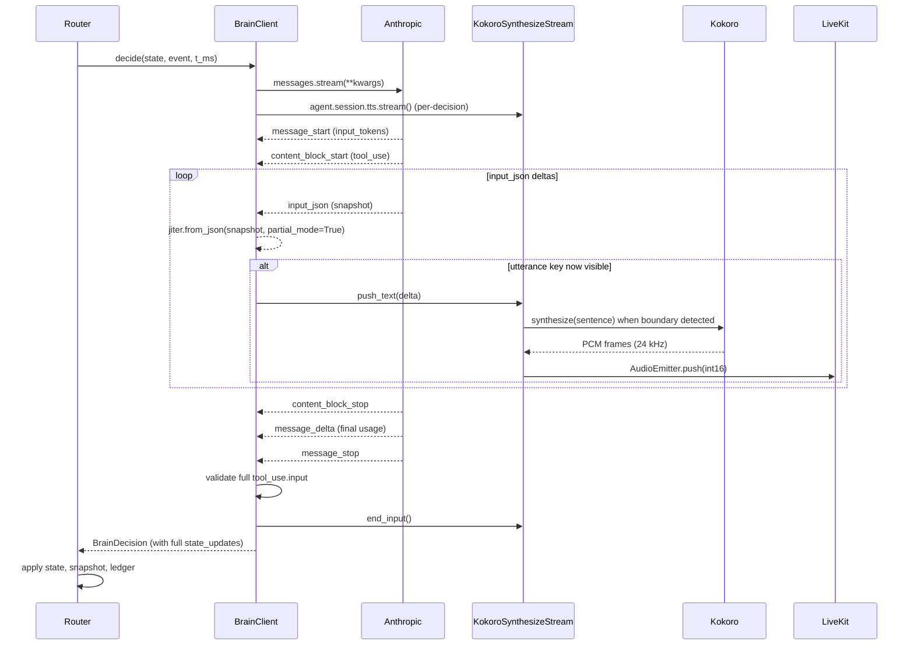

# M4 — Production Interview Behavior

## Overview

M4 closes the second half of "the earliest milestone that crosses the candidate-experience bar" (origin plan §92). M3 made the candidate's actions (drawing, speaking, ending the session) flow into the brain end-to-end; M4 makes the brain's voice fast enough, frugal enough, and behaviourally rich enough that a 45-minute session feels like a real interview rather than a slow oracle.

Six work streams land together because they share two underlying surfaces (the brain client + the event router) and would create churn if split:

1. **Streaming Anthropic tool-use → sentence-chunked Kokoro TTS.** Switch `BrainClient.decide(...)` from `messages.create(...)` to `async with messages.stream(...)`; surface `input_json` deltas for the `utterance` field; pipe sentence-bounded text into a streaming `KokoroEngine.synthesize` path so the candidate hears the first sentence ~1-2 s after a turn ends instead of after the full 7-15 s Opus latency observed in M2/M3 dogfooding.
2. **Haiku 4.5 session-summary compression.** Replace the M3-era hard cap (`_TRANSCRIPT_WINDOW_CAP = 30` truncates oldest) with a periodic non-blocking compression that folds dropped turns into `SessionState.session_summary`. The decisions log (`SessionState.decisions`) is never compressed — that invariant is sacred (CLAUDE.md, M2 plan, master plan).
3. **Content-based phase transitions + soft verbal nudges.** `EventType.PHASE_TIMER` exists in the event taxonomy but has no producer today. M4 wires a per-session timer task that fires `PHASE_TIMER` when a phase exceeds its soft budget by ~50%, and updates the brain prompt's `[Phase awareness]` clause so the brain advances on rubric-coverage signals + transcript content rather than time alone.
4. **Counter-argument state machine.** `SessionState.active_argument` already exists but has no per-turn semantics; M4 adds router-side `rounds` increment + auto-clear when the topic changes, and surfaces the steelman → teach → let-go progression in the brain prompt.
5. **Cost circuit breaker — M3 dogfood carry-overs.** Per-session cost projects to $20-30/hr at active drawing because every CANVAS_CHANGE drives a fresh Opus call (master plan §695-697). M4 adds (a) a *brain-input fingerprint skip* (no Opus call when the merged event payload is unchanged from the last call), (b) *exponential backoff* on consecutive `stay_silent` outcomes, (c) *queue-drain prioritisation* so a queued `speak` from a prior dispatch is delivered before the next dispatch starts (fixes the symmetric drop-on-TTL bug recorded in master plan §697 and the `dfc1c9e` / `0db135a` doc updates).
6. **Frontend cost telemetry.** Surface `SessionState.cost_usd_total` + `cost_cap_usd` in the session UI so a candidate (and the operator dogfooding) can see budget remaining. The agent already publishes a fixed-size `ai_state` payload over `publishData`; M4 either extends that payload or adds a sibling `ai_telemetry` topic following the same "fixed-size telemetry → publishData" rule M3 established.

**The M3 `transcript_window=0` dogfood finding is already resolved** in commit `ce90164` (`fix(agent): populate transcript_window + swallow PublishDataError on disconnect`). It's listed in master plan §696 as an M4 carry-over, but the fix already landed via the M3 hotfix train. M4 only needs to add a regression test that asserts `transcript_turns > 0` after the second utterance, not redo the diagnosis.

**Streaming and Haiku land in this single milestone, but as separable phases** (see §Phased Delivery). The streaming work is the largest unit by line-count and risk; Haiku is medium; the throttling and queue-drain fixes are small but high-value. Cost telemetry on the frontend is the smallest unit and lands last.

See origin: `docs/plans/2026-04-17-001-feat-ai-system-design-mentor-plan.md` (M4 section, lines 681-697 — including the dogfood findings rolled in via commits `a224ecb`, `dfc1c9e`, `0db135a`).

**Refinements absorbed 2026-04-27** (via `/ce:ideate` → `/ce:brainstorm` → 4-persona document review pass × 2). The earlier draft of this plan would have shipped: a `transcript_window_hash` + `summary_chars`-bucketed fingerprint (R1), a cooldown gate that ate PHASE_TIMER nudges (R2), an under-specified streaming-cancellation path (R3), an 11-field SessionTelemetry with a JSONB column on `sessions` and a `prompt_version` column on `brain_snapshots` (R4 + R5), `Settings.summary_compaction_threshold` and `Settings.haiku_model` env-tunable knobs with no consumer (R6), a `"keep"` schema sentinel on `new_active_argument` (R7), and four `docs/solutions/*.md` writeup deliverables (R8). Those were reviewed and either tightened (R1, R2, R3, R6, R7), reframed in-memory (R4 — 6 fields, no DB column, no migration), deferred to M5/M6 (R5 entirely), or cut (R8). See `docs/brainstorms/2026-04-26-m4-plan-refinements-requirements.md` for the full decision trail.

## Problem Frame

After M3 the candidate experience hangs together: log in, pick a problem, draw, talk, get reasoned interruptions, end the session, see Postgres rows cascade-delete. But three pain points showed up immediately on dogfooding the first 4-minute session (master plan §694-697):

- **Latency.** Opus 4.7 latency on Unbound is 7-15 s per call. The candidate finishes a turn, the AI state indicator says "thinking", and 10 seconds pass before any audio. At human-conversation rhythms this feels broken; the M3 R7-bundle thinking-elapsed copy ("Mentor is considering — keep going if you'd like") softens the stall but doesn't fix it.
- **Cost.** A 4-minute dogfood session burned ~$1.50 because every CANVAS_CHANGE event drove a fresh Opus call, and most of those decided `stay_silent`. Projected to a full 45-minute session of active drawing, this is $20-30 — six times the $5 cost cap the schema reserves per session. Streaming reduces *latency*, not call count; the call-count lever is throttling.
- **Dropped utterances.** The router serializes Opus calls; while one call is in flight, any queued `speak` payload from the prior call ages past `PendingUtterance.ttl_ms = 10_000`. Both directions of the asymmetry have been observed (TURN_END speak dropped by next CANVAS_CHANGE dispatch, and CANVAS_CHANGE speak dropped by next TURN_END dispatch). The candidate hears silence where they should hear a question.

M4 has to fix latency, cost, and reliability without breaking M2's serialised-router invariants (I1: one dispatch at a time; I2: external cancel propagates; I3: `t_ms` snapshot before any await) or the M3 priority-aware coalescer rule (CANVAS_CHANGE preempts; TURN_END text folds into `concurrent_transcripts`). It also has to land the brain-behaviour upgrades (Haiku, content-based phases, counter-argument FSM) the master plan promised for M4 — without them the session loses coherence past ~10 minutes as the rolling transcript saturates and the brain stops referencing earlier decisions.

The whole thing must keep working under the M3 carry-over gates: cost cap is router-side (no Anthropic call when capped), canvas state still updates upstream of router-handle (R23), R27's synthetic-recovery utterance fires once per session on `brain_timeout`.

## Requirements Trace

From the origin plan's M4 scope (lines 681-697), the M3 dogfood findings (lines 694-697 added in `a224ecb`/`dfc1c9e`/`0db135a`), and the M2/M3 invariants the implementation must preserve:

**Streaming + TTS:**

- **R1.** `BrainClient.decide(...)` reshaped to use `async with self._client.messages.stream(**kwargs) as stream`. Iterate `stream` events; on `input_json` events, parse the running snapshot via `jiter.from_json(snapshot, partial_mode=True)`; when the `utterance` key first appears as a string, hand the running text to the TTS sentence path. The full `BrainDecision` is still produced after `message_stop` so the existing jsonschema validator + state-update applier paths run unchanged.
- **R2.** Per-stream wall-clock budget remains `_BRAIN_DEADLINE_S = 180.0`; wrap the entire `async with` block in `asyncio.wait_for`. Per-attempt `httpx` read timeout stays 120 s. SDK `max_retries=2` still applies — the streaming SSE handshake is the retried operation.
- **R3.** SDK 4xx (`AuthenticationError`, `BadRequestError`) still raise; 5xx + rate-limit + `APIConnectionError` after the deadline still degrade to `BrainDecision.stay_silent("api_error")`. The R27 hook on `reason="brain_timeout"` / `"anthropic_api_connection_during_wait_for"` survives.
- **R4.** Schema-violation handling: full validation runs after `message_stop` against the accumulated `tool_use.input`. The XML-spillover recovery (`_recover_xml_tool_input`) runs only on the *final* dict — never on partial snapshots, since partial JSON can be syntactically incomplete. Streaming TTS that already played the partial `utterance` is NOT rolled back if the final validation fails (the audio already left the speaker); the `brain_decision` ledger row records `reason=schema_violation` and the router's consecutive-violation counter increments as today.
- **R5.** `KokoroStreamingTTS` advertises `tts.TTSCapabilities(streaming=True)`; `synthesize_stream(...)` returns a custom `tts.SynthesizeStream` that consumes text segments via `stream.push_text(...)` + `stream.flush()` and emits int16 PCM frames via `output_emitter`. Sentence boundary detection uses `livekit.agents.tokenize.basic.SentenceTokenizer().stream()` (LiveKit-native; no new dependency). One `SynthesizeStream` instance per brain decision (livekit-agents 1.x constraint).
- **R6.** Tool schema (`brain/tools.py::INTERVIEW_DECISION_TOOL`) reorders `properties` so `utterance` is declared first, then `reasoning`, then `decision`/`priority`/`confidence`/`state_updates`. Anthropic streams keys in declaration order; ordering `utterance` first means TTS can start as soon as the model commits to speaking.

**Haiku session-summary compression:**

- **R7.** New `HaikuClient` (process-wide singleton, mirrors `BrainClient` lock pattern) calls `messages.create` non-streaming against `claude-haiku-4-5` (or `anthropic/claude-haiku-4-5` on Unbound). Inputs: the dropped-from-window transcript turns + the *current* `session_summary`. Output: the new compressed summary string.
- **R8.** Trigger lives outside the router's serialised dispatch loop. A per-session compaction task on the `MentorAgent` schedules itself when `len(transcript_window) > _COMPACTION_THRESHOLD` (e.g. 30 turns) AND no compaction is currently in-flight. Cadence target: ~every 2-3 minutes of conversation, not by wall-clock — `transcript_window` size is the trigger because it's the prompt-size pressure signal.
- **R9.** `HaikuClient.compress(...)` runs in parallel to ongoing Opus calls (Opus serialisation gate is router-local; Haiku is on the agent). On completion, the result is folded back into `SessionState` via the existing `RedisSessionStore.apply` CAS path with a mutator that (a) appends to `session_summary` (using `with_state_updates({"session_summary_append": ...})`'s existing semantics) and (b) drops the compressed turns from `transcript_window`.
- **R10.** Decisions log untouchable. The mutator must NOT include `decisions` in its update set; existing tests assert `with_state_updates` doesn't drop `decisions` accidentally (`test_session_state.py`); add an explicit assertion that compaction preserves `decisions` byte-for-byte.
- **R11.** `BRAIN_RATES` (`brain/pricing.py`) extended with rows for `claude-haiku-4-5` and `anthropic/claude-haiku-4-5`. Both rows use Anthropic's published Haiku 4.5 rates (verify at implementation time — current public rates: $1.00/M input, $5.00/M output, $0.10/M cache read, $1.25/M cache write per the same family scaling Anthropic uses for Opus). Cost rolls into the existing `state.cost_usd_total` so the M2 cost cap covers Haiku calls automatically — the cap doesn't need to distinguish Opus vs Haiku.
- **R12.** New ledger event type `SUMMARY_COMPRESSED` on `SessionEventType` (Postgres enum), plus an Alembic migration with `ALTER TYPE sessioneventtype ADD VALUE 'summary_compressed'`. Payload: `{model, input_tokens, output_tokens, cost_usd, dropped_turn_count, summary_chars_before, summary_chars_after}`. Replay (`scripts/replay.py`) uses these rows to reconstruct the timeline. Only one new enum value lands in M4 — soft phase-nudge data is observable via the existing `BRAIN_DECISION` snapshot row, discriminated by `event_payload.type='phase_timer'`. Adding `PHASE_NUDGE` was considered and rejected (see Open Questions, §Resolved During Planning).

**Content-based phase transitions + soft nudges:**

- **R13.** Per-session phase-timer producer task started from `MentorAgent.on_enter`. Loop: every 30 s, compute `elapsed_in_phase_s` from `state.started_at` + last `phase_advance` t_ms (recorded in a new `SessionState.last_phase_change_s` field); if it exceeds the per-phase soft budget by ≥50%, dispatch one `RouterEvent(type=EventType.PHASE_TIMER, priority=LOW, payload={"phase": current.value, "over_budget_pct": …})` and remember it was fired so we don't re-fire every tick. Reset on `phase_advance`.
- **R14.** Per-phase budgets live as a single module constant (`PHASE_SOFT_BUDGETS_S`) inlined in `state/session_state.py` next to `InterviewPhase`: INTRO 120 s, REQUIREMENTS 300 s, CAPACITY 300 s, HLD 780 s, DEEP_DIVE 780 s, TRADEOFFS 300 s, WRAPUP 120 s — sums to 2700 s = 45 min, matching `InterviewSession.duration_s_planned`.
- **R15.** System prompt (`brain/prompts/system.md`) `[Event payload shapes]` clause expanded for `phase_timer`: `phase` (current phase), `over_budget_pct` (numeric); brain instructed to issue a verbal nudge ("we're past time on requirements — let's start on the high-level design") rather than forcing transitions. The `[Phase awareness]` clause is rewritten to make rubric-coverage thresholds the primary phase-advance signal.
- **R16.** Soft-nudge observability rides the existing `BRAIN_DECISION` snapshot row + `brain_decision` ledger event. Each PHASE_TIMER dispatch produces a snapshot whose `event_payload.type == "phase_timer"`, with `over_budget_pct` carried in the payload; the brain's `speak`/`stay_silent` outcome and any spoken nudge land in the same row. No new ledger event type.

**Counter-argument state machine:**

- **R17.** `SessionState.active_argument.rounds` is incremented router-side, not brain-side. After every dispatch, if the prior `state.active_argument.topic == new_active_argument.topic` (same argument continues), increment `rounds` by 1; if different topic, replace whole-cloth and start at `rounds=1`; if `new_active_argument is None` and prior wasn't, the brain has let it go — clear the field and write a `BRAIN_DECISION` ledger row with `argument_resolved: true`.
- **R18.** Auto-clear stale arguments: if `now - active_argument.opened_at_ms > 180_000` (3 minutes) AND `rounds == 0` (brain hasn't actually spoken about it), clear it as a stale opener — the moment passed.
- **R19.** System prompt `[Counter-argument]` clause expanded: "if `active_argument.rounds >= 2` and the candidate hasn't moved, teach with a concrete example then resolve; if `rounds >= 3`, let it go regardless." This is the brain's content-side mirror of the router-side counter.

**Cost circuit breaker (M3 dogfood carry-overs):**

- **R20.** *Brain-input fingerprint skip — narrowed inputs (refinements R1).* Before dispatching to `BrainClient.decide`, the router computes a SHA-256 over `(transcript_turn_count, decisions_count, phase, active_argument.topic, event_payload)` only — *no* `transcript_window_hash`, *no* `summary_chars`, *no* `canvas_description_hash`. The narrowed input set keeps the throttle stable across Haiku compaction's parallel `session_summary` mutations (which legitimately don't change the brain's decision surface) while still flipping the fingerprint when compaction's transcript-window decrement IS material (transcript_turn_count drops). If the fingerprint matches the last successful call AND the prior decision was `stay_silent` AND no candidate utterance has arrived since (turn_end clears the cache), short-circuit to `BrainDecision.skipped_idempotent()` — emit a snapshot row with `reason=skipped_idempotent`, no Anthropic call, no cost. Canvas state still applies upstream of router-handle per R23 (M3 invariant); the ledger `canvas_change` event still records `parsed_text`. Master plan §695 lever (a). **Property test (binding):** "fingerprint stable across `session_summary` mutation that does NOT change `transcript_turn_count`." See refinements brainstorm R1 for the input-narrowing rationale.
- **R21.** *Exponential backoff on consecutive `stay_silent` — PHASE_TIMER bypasses (refinements R2).* Track `consecutive_stay_silent` in router state. On the *N*th consecutive `stay_silent`, the next event of the same type within `cooldown_ms = base * 2**(N-1)` is short-circuited to `BrainDecision.skipped_cooldown(reason="stay_silent_backoff", cooldown_ms=...)` — same snapshot + ledger discipline. `base = 4_000`, max cooldown 60_000 ms. Resets on any `speak` decision or any TURN_END event (candidate finished talking → take the call). **PHASE_TIMER bypasses the cooldown gate** because it exists *to break a stuck silence* — a `consecutive_stay_silent=4` cooldown of 32 s would otherwise eat a PHASE_TIMER nudge fired at second 30, defeating the very signal designed for that case. PHASE_TIMER still passes through the fingerprint-skip gate; per-phase 90 s nudge dedup (Unit 7) is the operational dedup mechanism. Master plan §695 lever (b).
- **R22.** *Queue-drain prioritisation.* When the router's `_dispatch_loop` re-enters and `pending` is non-empty, check `self._queue.peek_fresh()` first — if a fresh `PendingUtterance` is queued from the prior dispatch and the candidate isn't speaking, signal the agent to drain it before starting the next brain call. Implementation: a router → agent callback (`on_pre_dispatch`) the agent registers; the agent's `_drain_utterance_queue()` already handles the speech-check + lock semantics. Master plan §697.
- **R23.** *Freshness-aware TTL while a brain call is in-flight.* Extend `PendingUtterance.ttl_ms` by the duration of any brain call running while the utterance sits queued (i.e. don't penalise the queued speak for the wait it didn't choose). Implementation: `UtteranceQueue.bump_ttls(extra_ms)` called from `EventRouter._dispatch` `try`/`finally` — the duration of the brain call is added to every queued item's effective TTL. Master plan §697 lever (b).

**Frontend cost telemetry:**

- **R24.** Agent publishes a sibling `ai_telemetry` topic via `publishData` on every brain decision (mirrors `ai_state` cadence), payload `{cost_usd_total, cost_cap_usd, calls_made, tokens_in_total, tokens_out_total}`. Capped at ~80 bytes; fits the "fixed-size telemetry → publishData" rule the M3 plan established. Cadence-throttled to once per dispatch; not on every Haiku call.
- **R25.** New `<CostBudgetIndicator>` component in `apps/web/components/livekit/session-room.tsx` shows e.g. "$0.42 / $5.00" with a thin progress bar. Lives next to `<AiStateIndicator>` in the session shell; collapses to "$0.42" when budget < 50% to avoid drawing the candidate's eye. Updates on `data_received` from the agent.

**Already landed (no work in M4):**

- `transcript_window=0` regression — fixed in commit `ce90164`. M4 adds a regression test asserting `transcript_turns > 0` after the second utterance.

## Scope Boundaries

- **No agent-tool parity for the streaming brain.** A future eval-harness "drive a streaming brain call" tool is M6.
- **No frontend transcript pane.** The candidate sees `AiStateIndicator` (M3) + `CostBudgetIndicator` (M4 R25) and hears the AI; the live transcript pane is M6 polish.
- **No cost-tier model fallback.** If we hit the cost cap, the router stays silent (M2 behaviour). M4 does NOT switch Opus → Haiku for the live brain when budget runs low — that would change session quality silently and is M6 territory if we revisit.
- **No language-aware sentence tokenizer.** LiveKit's built-in `SentenceTokenizer` is English-tuned; M4 uses it as-is. Candidates code-switch between English and romanised Hindi (per `system.md::[STT errors]`); the tokenizer treats those as English, which is acceptable.
- **No voice-activity-driven phase advancement.** Phase advancement still flows through `state_updates.phase_advance` from the brain, on-content-signals. M4 adds the *nudge* (PHASE_TIMER), not an automatic transition.
- **No vision/OCR for canvas image elements.** Still M5+; M4 leaves image elements as `[embedded image]` placeholders per M3.
- **No durable storage of `session_summary`.** The compressed summary lives in Redis `SessionState` for the life of the session; on session end it's persisted to a brain snapshot (existing path), but no separate `session_summaries` table. M5 may want one for reports.
- **No Postgres column for `cost_actual_usd` updates from the agent.** `apps/api/archmentor_api/models/session.py::cost_actual_usd` exists but is a planned reporting field (M5). Frontend telemetry reads agent-side state via LiveKit data; no API round-trip.
- **No prompt-A/B tooling.** M6 eval harness owns A/B comparison; M4 ships one phase prompt + one counter-argument prompt; iteration is by edit + re-deploy.
- **No retry on Haiku failure.** If the Haiku call fails (5xx, timeout), the `transcript_window` keeps its hard-cap fallback — drop oldest, no summary update. The next compaction tick will retry. Add a `summary_compression_failed` ledger event with the error class.
- **No streaming for Haiku.** Haiku call is non-streaming (`messages.create`). Streaming Haiku adds zero candidate-facing latency benefit (the summary doesn't TTS).

### Deferred to Separate Tasks

- **Stale-session reaper for ENDED-but-not-cleaned Redis keys.** M6.
- **Reconnection / canvas resync on agent worker crash.** M6.
- **Per-session prompt versioning columns on `brain_snapshots`.** M6 eval harness.
- **MinIO migration for canvas snapshots.** M5 / M6.
- **Frontend transcript pane.** M6 polish.
- **API-side cost rollup to `sessions.cost_actual_usd`.** M5 reporting.
- **Eval harness replay of streaming snapshots.** M6 — `scripts/replay.py` continues to use the non-streaming code path for replay; the streaming path is for live calls only.

## Context & Research

### Relevant Code and Patterns

- `apps/agent/archmentor_agent/brain/client.py:107-160` — current `BrainClient.decide` non-streaming call, wrapped in `asyncio.wait_for(_BRAIN_DEADLINE_S=180.0)`. R1/R2/R3 reshape this method around `messages.stream`.
- `apps/agent/archmentor_agent/brain/client.py:148-220` — TimeoutError + APIConnectionError-after-deadline + 4xx/5xx handling. Streaming variant must re-derive the same semantics around the async context manager.
- `apps/agent/archmentor_agent/brain/client.py:344-385` — `_recover_xml_tool_input` (XML-tool-use spillover recovery). R4: only run on the final accumulated dict, never on partial snapshots.
- `apps/agent/archmentor_agent/brain/client.py:419-443` — `get_brain_client` singleton (threading.Lock double-check). R7: mirror this pattern in `get_haiku_client`.
- `apps/agent/archmentor_agent/brain/prompt_builder.py:113-139` — `build_call_kwargs`. R5/R6: same builder; the streaming path passes the same kwargs to `messages.stream` instead of `messages.create`.
- `apps/agent/archmentor_agent/brain/tools.py:30-121` — `INTERVIEW_DECISION_TOOL` schema. R6 reorders `properties` so `utterance` streams first.
- `apps/agent/archmentor_agent/brain/decision.py:114-179` — `BrainDecision.from_tool_block`. Existing factory; streaming path calls it once on the final accumulated input.
- `apps/agent/archmentor_agent/brain/decision.py:207-249` — `schema_violation`/`stay_silent`/`cost_capped` constructors. R20/R21 add `skipped_idempotent` and `skipped_cooldown` factories with the same `_silent` skeleton.
- `apps/agent/archmentor_agent/brain/pricing.py:69-101` — `BRAIN_RATES` table + `estimate_cost_usd`. R11: add Haiku rows.
- `apps/agent/archmentor_agent/state/session_state.py:67-70, 105, 123, 135-192` — `PendingUtterance`, `session_summary`, `active_argument`, `with_state_updates`. R7-R10 (Haiku): reuse `session_summary_append` semantics. R17 (counter-argument): the `with_state_updates` translation already overwrites `active_argument` whole-cloth; add the rounds-increment helper.
- `apps/agent/archmentor_agent/events/router.py:108-150` — `EventRouter.__init__`. R20-R23 add `_consecutive_stay_silent`, `_last_input_fingerprint`, `_pre_dispatch_callback` fields.
- `apps/agent/archmentor_agent/events/router.py:225-324` — `_dispatch_loop` + `_dispatch`. R20 (fingerprint skip) gates Anthropic call; R21 (cooldown) wraps it; R22 (queue-drain pre-dispatch) hooks at top of `_dispatch_loop` body.
- `apps/agent/archmentor_agent/events/router.py:344-360` — `_apply_decision`. Cost roll-in for Haiku rides through the same path; Haiku usage attributes to a separate counter (see Open Questions: "single cost bucket vs split").
- `apps/agent/archmentor_agent/events/types.py:36-73` — `EventType.PHASE_TIMER` declared, no producer. R13 adds the producer.
- `apps/agent/archmentor_agent/events/coalescer.py:36-105` — priority-aware merge; PHASE_TIMER is LOW so it loses to anything else in a batch (M3 invariant). R13 emits PHASE_TIMER regardless; the coalescer drops it when concurrent events fired.
- `apps/agent/archmentor_agent/main.py:104, 985-1046` — `_TRANSCRIPT_WINDOW_CAP=30` + `_append_transcript_turn` CAS path. R8/R9 (Haiku): the compactor task replaces the hard truncation at line 1023.
- `apps/agent/archmentor_agent/main.py:374, 569-615` — `_say_lock` + `_drain_utterance_queue`. R22 hooks here.
- `apps/agent/archmentor_agent/main.py:336-368` — fire-and-forget task tracking pattern (`_ledger_tasks`, `_snapshot_tasks`, `_canvas_tasks`, `_synthetic_tasks`). R7 (Haiku) adds `_summary_tasks` following the same set + done-callback discipline.
- `apps/agent/archmentor_agent/main.py:641-686` — `MentorAgent.shutdown` drain order. R7 + R13: drain `_summary_tasks` after `_synthetic_tasks` and the new `_phase_timer_task` task before the router drain.
- `apps/agent/archmentor_agent/main.py:688-714` — `_publish_state` for `ai_state` topic. R24 adds a sibling `_publish_telemetry` method on the same `publishData` transport.
- `apps/agent/archmentor_agent/audio/framework_adapters.py:203-248` — `KokoroStreamingTTS` advertising `streaming=False` + `_KokoroChunkedStream`. R5 flips to `streaming=True` and adds a custom `tts.SynthesizeStream` subclass.
- `apps/agent/archmentor_agent/tts/kokoro.py:55-145` — `synthesize` is already an `AsyncIterator`. R5 keeps this helper unchanged; the streaming wrapper calls it per sentence.
- `apps/agent/archmentor_agent/queue/utterance_queue.py:62-115` — `pop_if_fresh`, `clear_stale_on_new_turn`. R23: add `bump_ttls(extra_ms)` and `peek_fresh()`.
- `apps/agent/archmentor_agent/queue/speech_check.py:35-67` — `SpeechCheckGate`. R22 reuses unchanged.
- `apps/api/archmentor_api/models/session_event.py:20-30` — `SessionEventType` (Postgres enum). Unit 6 adds only `SUMMARY_COMPRESSED`; soft phase-nudge data rides the existing `BRAIN_DECISION` snapshot row (per R16).
- `apps/api/archmentor_api/models/_base.py:31-49` — `str_enum_column` helper. The Alembic migration must use `op.execute("ALTER TYPE sessioneventtype ADD VALUE 'summary_compressed'")` (one statement per value; can't run inside a transaction in Postgres < 12, but Alembic 1.x handles this with `op.get_context().autocommit_block()`).
- `apps/web/components/livekit/session-room.tsx:43-95, 425-468, 546-599` — existing data-channel + AiStateIndicator pattern. R25 adds `CostBudgetIndicator` as a sibling component reading the same `data_received` event under topic `ai_telemetry`.
- `apps/agent/tests/test_brain_client.py:123-150, 261-281` — `_FakeAnthropic`/`_FakeMessages` test harness. R1: extend with an `AsyncContextManagerMock` that yields a fake `AsyncMessageStream` emitting deterministic event sequences.
- `apps/agent/tests/test_event_router.py` — current router tests (cost-cap, schema-violation escalation, R27 emitter). R20-R23: add tests for fingerprint skip, exponential backoff, queue-drain pre-dispatch, TTL bump.
- `docs/plans/2026-04-25-001-feat-m3-canvas-and-session-lifecycle-plan.md:156-174` — M3 Key Technical Decisions M4 must respect (CAS read-after-apply, HIGH-doesn't-bypass-cap, R27 once-per-session, fixed-size-telemetry rule for publishData).
- `docs/plans/2026-04-22-001-feat-m2-brain-mvp-plan.md` — M2 router invariants I1/I2/I3; the streaming variant must preserve them all.

### Institutional Learnings

`docs/solutions/` does not yet exist (M3 plan noted the same). Per refinements R8, M4 does NOT seed institutional-learnings writeups — the load-bearing context that needs to survive (lock-split design, fingerprint-input rationale, streaming-error decision matrix) lives inline in the plan + as docstrings/comments in production code. M5 may revisit if a lesson hardens post-dogfood.

### External References

- Anthropic SDK Python `messages.stream` — `AsyncMessageStream`, helper events (`message_start`, `content_block_start`, `text`, `input_json`, `content_block_stop`, `message_delta`, `message_stop`). Pin: `anthropic==0.96.0` (already in `apps/agent/pyproject.toml:9`). No bump required.
- Tool-use streaming guarantees — Anthropic's "one complete key/value pair before moving to next" emission ordering; `fine-grained-tool-streaming-2025-05-14` beta header NOT used (we don't need character-level granularity within keys; the SDK's `partial_mode=True` jiter parsing is sufficient).
- Anthropic Haiku 4.5 pricing — verify at implementation time; current public rate card: $1.00/M input, $5.00/M output. `BRAIN_RATES` rows derived from there. Re-check before merging the Haiku unit.
- `streaming-tts==0.3.8` — `KokoroEngine.synthesize(text)` is an atomic call; no `device=` kwarg in the public signature; per-call inference cost only after first-load. No bump required (already in `apps/agent/pyproject.toml:38`).
- `livekit-agents==1.5.4` — `tts.TTS` subclass + `tts.SynthesizeStream` + `tts.AudioEmitter` + `tokenize.basic.SentenceTokenizer().stream()`. Already pinned (`apps/agent/pyproject.toml:10`).
- LiveKit `python-agents-examples/llm_powered_content_filter` — reference pattern for streaming text → TTS via SentenceTokenizer.
- Alembic Postgres enum migration — `op.execute("ALTER TYPE … ADD VALUE")` runs inside `autocommit_block()` (Alembic 1.10+). Existing migration helper pattern in `apps/api/migrations/versions/`.

## Key Technical Decisions

- **Streaming brain client rebuilds on top of the existing `BrainClient`, doesn't replace it.** Same singleton, same `decide(...)` entry point, same return type (`BrainDecision`). The streaming path is the production default; the non-streaming `_decide_blocking` body stays in the codebase but is reached only when the caller (e.g. `scripts/replay.py`) explicitly invokes it for replay determinism. No `Settings.brain_streaming` env flag — fast revert is a code revert. Speculative kill-switch flags accumulate as dead config; we already have one (`brain_enabled`) for the broken-key case, that is enough.
- **TTS streaming uses livekit-agents' `SynthesizeStream` + LiveKit's built-in `SentenceTokenizer`.** Don't write a custom sentence tokeniser; LiveKit's covers the patterns we need (`.?!\n` + minimum-char + soft-timeout) and is what the framework's adapters expect. The English-only assumption is acceptable per Scope Boundaries.
- **Tool schema property ordering matters.** Anthropic streams keys in declaration order. The schema in `brain/tools.py` is reordered so `utterance` is the first key declared — this minimises time-to-first-audio (TTFA). `reasoning` and `state_updates` come later because they're persisted, not spoken.
- **Haiku runs OFF the router's serialisation gate.** The router's "one Opus call in flight" invariant (M2 I1) is router-local; a parallel Haiku call on the agent doesn't violate it. Compaction is fire-and-forget against `_summary_tasks` task set; CAS apply at completion handles concurrent Opus state writes.
- **Compaction trigger is transcript-window-size, not wall-clock.** The token-cost pressure of an oversized prompt is the real signal; firing every 2-3 minutes regardless wastes Haiku calls in slow phases (INTRO has long gaps with low utterance count). Threshold: `len(transcript_window) > 30`. Re-trigger gating: `_summary_in_flight: bool` flag prevents reentry.
- **Phase-timer is a producer-side timer task, not a brain-emitted event.** The brain doesn't know wall-clock time precisely (its `state.elapsed_s` is a snapshot); the agent does. A 30-second producer task is the smallest reliable cadence; PHASE_TIMER is LOW priority so it loses to anything else in a coalesced batch — exactly what we want for "soft nudge".
- **Counter-argument rounds counter is router-side.** The brain emits `new_active_argument` with the desired topic + push-back state but does NOT manage `rounds`. The router compares `prior.topic` to `new.topic` and increments / replaces / clears. This avoids the brain forgetting the counter (observed in M3 dogfooding for `rubric_coverage_delta` short-form).
- **Brain-input fingerprint inputs (refinements R1) — narrowed.** Hash `(transcript_turn_count, decisions_count, phase, active_argument.topic, event_payload)` only. `transcript_window_hash`, `summary_chars`, and `canvas_description_hash` are deliberately NOT in the input set: summary mutations alone (Haiku compaction's parallel CAS appends) and canvas description churn alone do not flip the fingerprint, which is the throttle's purpose. Compaction's transcript-window decrement DOES flip the fingerprint (correct — brain reads compressed summary plus smaller window). `pending_utterance` and `cost_usd_total` are also out (transient queue artifact / would never match across calls). Property test invariant: "fingerprint stable across `session_summary` mutation that does NOT change `transcript_turn_count`."
- **Exponential backoff resets on TURN_END; PHASE_TIMER bypasses cooldown (refinements R2).** A candidate finishing a sentence is the strongest signal that the "stay_silent" cycle is over. CANVAS_CHANGE alone is not enough — the candidate may be drawing while saying nothing, exactly the case the cost throttle exists to suppress. **PHASE_TIMER bypasses the cooldown gate entirely** because it exists *to break a stuck silence*; without bypass, a 32 s cooldown after 4 consecutive `stay_silent`s would eat the very PHASE_TIMER fired at second 30. PHASE_TIMER still passes through fingerprint-skip; per-phase 90 s nudge dedup (Unit 7) is the operational dedup mechanism.
- **Queue-drain prioritisation runs once per dispatch-loop iteration, before the merged-batch dispatch.** That is the natural cadence; drains aren't cheap (they call `session.say`, which under streaming pulls audio through Kokoro), and we don't want to interleave them inside a single brain call.
- **Cost telemetry rides over `publishData`, not text streams.** The payload is fixed-size (~80 bytes), matching the M3 plan's "fixed-size telemetry → publishData" rule. Updating the rule's docstring to mention `ai_telemetry` keeps the convention discoverable.
- **No per-call Haiku budget cap.** Haiku at $1/M input is roughly 15× cheaper than Opus; a typical compaction call is ~3-5 KB of transcript = ~1k tokens = ~$0.001. The shared `cost_cap_usd` cap covers it.

## Open Questions

### Resolved During Planning

- **Streaming brain — reuse `BrainClient.decide` or new method?** → Reuse. The streaming path is the production default; `_decide_blocking` stays in the file but is reached only by direct invocation from `scripts/replay.py`. No env flag — code revert is the rollback.
- **New `PHASE_NUDGE` ledger event type or rely on `BRAIN_DECISION` snapshot discriminator?** → Rely on `BRAIN_DECISION` + `event_payload.type='phase_timer'`. A separate type adds enum value + Alembic migration noise for data already discriminable from the snapshot row. Replay tooling reads the snapshot anyway; no information loss.
- **Sentence boundary detection — custom or LiveKit's `SentenceTokenizer`?** → LiveKit's. No new dependency, English-tuned matches our user base, framework idiom.
- **Haiku trigger — wall-clock or transcript-window size?** → Transcript-window size (>30 turns). Wall-clock fires too often in slow phases.
- **Counter-argument rounds — brain-side or router-side counter?** → Router-side. The brain has shown it forgets state on long horizons; a deterministic counter is more reliable.
- **Cost telemetry transport — `publishData` or text stream or HTTP poll?** → `publishData`. Fixed-size payload matches the established rule; no API round-trip needed.
- **Cost-bucket split — single `cost_usd_total` or split Opus/Haiku?** → Single. The $5 cap is a session budget, not a per-model budget; splitting introduces a new column on `SessionState` for no observable benefit. Replay tooling can attribute by `model` field on each `BrainSnapshot`/`SUMMARY_COMPRESSED` event.
- **Streaming-TTS streaming capability flag — flip on `KokoroStreamingTTS` or write a sibling class?** → Flip on the existing class. The class is named `KokoroStreamingTTS` for a reason; it advertised `streaming=False` only because M3's TTS path was synchronous. M4 makes the name accurate.

### Deferred to Implementation

- **Exact retry semantics for streaming SDK transient errors.** The SDK retries the SSE handshake; once we're streaming, what's the right behaviour on a mid-stream `APIConnectionError`? Likely: degrade to `BrainDecision.stay_silent("api_error")`, log, and let the next dispatch try fresh. Resolve while writing R1's tests.
- **Fingerprint exact field set.** `phase` + `active_argument.topic` + `transcript_window` hash + `canvas_state.description` hash + merged event payload — verify under integration test that no field flicker (e.g. `last_change_s` rounded differently per call) causes false misses. Possibly hash a stable JSON serialization of a curated subset.
- **Phase-budget tuning.** The 120/300/300/780/780/300/120-second split sums to 2700 but matches no empirical data; M4 ships these values and adjusts based on first-week dogfooding. Document the assumption next to `PHASE_SOFT_BUDGETS_S` in `state/session_state.py` so it's grep-able.
- **First-sentence minimum length.** LiveKit's `SentenceTokenizer` defaults vary (~25 chars first / ~60 chars later, per framework-docs research). Tune for Kokoro's TTFA on Apple Silicon — too short → choppy; too long → defeats the streaming win. Resolve while implementing R5.
- **Whether to dedup phase nudges per phase.** Once we nudge for over-budget on a phase, do we re-nudge if the candidate stays in that phase for another 30 s? Probably yes, with a per-phase floor (no more than 1 nudge per 90 s). Resolve in R13 implementation.
- **Frontend cost-cap UX when capped.** Today the brain just stays silent; should the UI show "Mentor is now in observation-only mode" when `cost_usd_total >= cost_cap_usd`? Tentative yes, but not blocking M4 — the underlying behaviour is unchanged.

## High-Level Technical Design

> *This illustrates the intended approach and is directional guidance for review, not implementation specification. The implementing agent should treat it as context, not code to reproduce.*

### Streaming brain → sentence-chunked TTS sequence



### Cost throttle decision matrix

| Pre-dispatch state | Brain-input matches last? | Consecutive `stay_silent` | Action |
|---|---|---|---|
| Normal | No | 0 | Dispatch (unchanged from M3) |
| Normal | Yes (canvas no-op, no new turn) | 0 | Skip → `BrainDecision.skipped_idempotent()` |
| Backoff | — | N (cooldown active) | Skip → `BrainDecision.skipped_cooldown(cooldown_ms)` |
| TURN_END arrives | — | reset to 0 | Dispatch always |
| Cost-capped | — | — | `BrainDecision.cost_capped()` (M2 path, unchanged) |

### Counter-argument rounds state machine

```
            new_active_argument == None
            and prior == None
                  │
                  ▼
              ┌────────┐
              │ idle   │
              └────────┘
                   │ new_active_argument != None
                   ▼
            ┌─────────────┐  same topic, candidate_pushed_back
            │ rounds=1    │──────────────────────────────► rounds=2 ──► rounds=3
            │ open        │  brain steelmans              brain teaches  brain lets go
            └─────────────┘                                    │              │
                  ▲                                            │              │
                  │ different topic                            ▼              ▼
                  └─────────────────────────── auto-clear (3 min stale, rounds==0)
                                                            │
                                                            ▼ new_active_argument == None
                                                       back to idle
                                                       (ledger: argument_resolved=true)
```

## Implementation Units

Ten units across seven phases (grouped as four waves in §Phased Delivery). Phases 1-2 are independent and can land in either order; Phase 3 depends on neither but is the largest unit; Phases 4, 5, 6 share state code paths so they sequence after 3; Phase 7 is verification + dogfood and runs last.

### Phase 1 — Cost throttle quick wins (M3 dogfood carry-overs)

- [x] **Unit 1: Brain-input fingerprint skip + exponential backoff in `EventRouter`** (landed `b29e345`)

**Goal:** Cut Opus call count under active drawing without changing the candidate's experience. Land both throttling levers from master plan §695.

**Requirements:** R20, R21

**Dependencies:** None. Independent of streaming work.

**Files:**
- Modify: `apps/agent/archmentor_agent/events/router.py`
- Modify: `apps/agent/archmentor_agent/brain/decision.py` (add `skipped_idempotent` + `skipped_cooldown` factories)
- Test: `apps/agent/tests/test_event_router.py` (extend)

**Approach:**
- Add `_last_input_fingerprint: str | None`, `_last_input_decision_kind: DecisionKind | None`, `_consecutive_stay_silent: int`, `_cooldown_until_ms: int` fields to `EventRouter.__init__`.
- Compute fingerprint inside `_dispatch` after `_load_state`, before the cost-cap check: SHA-256 over a stable JSON serialisation of `{transcript_turn_count, decisions_count, phase, active_argument_topic, fingerprint_payload}`. Stable serialisation is `json.dumps(payload, sort_keys=True, ensure_ascii=False, separators=(",", ":"))` — lock these kwargs in to prevent dict-ordering or whitespace drift from flickering the hash.
- **`fingerprint_payload` is a curated subset, not the merged event payload directly.** Add a new helper `_fingerprint_payload(merged: RouterEvent) -> dict` next to `_event_to_payload` at `apps/agent/archmentor_agent/events/router.py:503`. The helper returns ONLY the brain-decision-relevant content fields, EXPLICITLY STRIPPING: `t_ms` (per-batch wall-clock; would flicker every dispatch), `merged_from` (order-sensitive list of source events; coalescer drain order is not byte-stable). For HIGH-priority batches, `concurrent_transcripts` is sorted by `(t_ms, text)` before hashing. For TURN_END collapse batches, `transcripts` is sorted likewise. **Do NOT reuse `_event_to_payload` for fingerprinting** — that helper exists for the brain prompt + snapshot row where `t_ms` IS material; fingerprinting needs a different shape.
- **Note (refinements R1):** `transcript_window_hash`, `summary_chars`, and `canvas_description_hash` are deliberately NOT in the input set. The brain's decision surface is captured by `transcript_turn_count` (changes on compaction or new turn) + the four scalar fields + the curated fingerprint_payload. Summary mutations alone or canvas description churn alone do not flip the fingerprint, which is the throttle's purpose. Compaction's transcript-window decrement DOES flip it (correct behaviour — brain reads compressed summary plus smaller window).
- Skip when `fingerprint == _last_input_fingerprint and _last_input_decision_kind == "stay_silent" and merged.type != EventType.TURN_END and merged.type != EventType.PHASE_TIMER`. On skip, build `BrainDecision.skipped_idempotent()` and continue through the existing snapshot + ledger emission path so replay rows still land.
- Skip on cooldown: `if self._now_ms() < self._cooldown_until_ms and merged.type != EventType.TURN_END and merged.type != EventType.PHASE_TIMER: BrainDecision.skipped_cooldown(...)`. **PHASE_TIMER bypasses cooldown (refinements R2)** because it exists *to break a stuck silence* — the cooldown defeating that signal inverts the UX. PHASE_TIMER still passes through the fingerprint-skip gate but per-phase 90 s nudge dedup (Unit 7) is the operational dedup mechanism.
- After `decide()` returns: update `_consecutive_stay_silent` (++ on stay_silent, reset to 0 on speak / TURN_END / fingerprint-skip-don't-count), recompute `_cooldown_until_ms = self._now_ms() + min(60_000, 4_000 * 2 ** (n-1))` when N ≥ 2.
- `BrainDecision.skipped_idempotent` and `BrainDecision.skipped_cooldown` reuse `_silent` skeleton; `usage` is `BrainUsage()` (no tokens consumed); reasoning empty; reason discriminates.

**Patterns to follow:**
- `apps/agent/archmentor_agent/events/router.py:142, 416-446` — existing `_consecutive_schema_violations` counter is the template.
- `apps/agent/archmentor_agent/brain/decision.py:181-249` — existing `_silent` factory pattern.

**Test scenarios:**
- *Happy path:* Two identical CANVAS_CHANGE events back-to-back with no TURN_END between → first dispatches and gets `stay_silent`; second short-circuits to `skipped_idempotent` with snapshot row + `brain_decision` ledger row + zero `BrainUsage`.
- *Edge case:* Identical CANVAS_CHANGE events sandwiching a TURN_END → both Opus-call dispatched (TURN_END resets fingerprint).
- *Edge case:* Two `stay_silent` outcomes from non-skipped Opus calls → next CANVAS_CHANGE within 8 s short-circuits to `skipped_cooldown` with `cooldown_ms=8000`; the one after (≥8 s later) dispatches.
- *Edge case:* Cooldown at N=10 → `cooldown_ms` clamps at 60_000, not 4 * 2^9 = 2048 s.
- *Error path:* Cost-capped session → fingerprint/cooldown logic short-circuits skipped (M2 cost-cap path runs first; nothing changes).
- *Integration:* Fingerprint excludes `pending_utterance`, `cost_usd_total`, `transcript_window_hash`, `summary_chars`, `canvas_description_hash`, `t_ms`, and `merged_from` — assert two states/payloads differing only in those fields produce the same hash. (Two CANVAS_CHANGE events arriving 500 ms apart with identical content must fingerprint-match.)
- *Integration:* `consecutive_stay_silent` resets to 0 after a `speak` decision.
- *Property test (binding, refinements R1):* fingerprint stable across `session_summary` mutation that does NOT change `transcript_turn_count`. Use Hypothesis to generate paired states `(state, state.with_session_summary_appended(...))` and assert equal fingerprints; assert different fingerprints when `transcript_turn_count` differs.
- *Edge case (refinements R2):* PHASE_TIMER fired during `_cooldown_until_ms > now_ms` window dispatches normally (does not short-circuit to `skipped_cooldown`). PHASE_TIMER fired with identical `over_budget_pct` to last call short-circuits to `skipped_idempotent` (fingerprint matches).
- *Edge case (refinements R2):* PHASE_TIMER does not reset `_consecutive_stay_silent` on dispatch — only `speak` decisions and TURN_END events reset it (otherwise an over-budget phase silence would mask a stuck-silence state).

**Verification:**
- Backoff log line `router.cost_throttle.skipped` includes `reason`, `consecutive_n`, `cooldown_ms`.
- Replay of a session with the unit applied shows zero behaviour drift on TURN_END events; CANVAS_CHANGE-only sequences show ≥50% reduction in `brain.call.begin` lines.

---

- [x] **Unit 2: Queue-drain prioritisation + freshness-aware TTL** (landed `6a6a2f4`)

**Goal:** Stop dropping `speak` payloads when a competing event delays drain. Implements master plan §697 levers (a) and (b).

**Requirements:** R22, R23

**Dependencies:** None. Co-lands with Unit 1 in Phase 1 but is independent.

**Files:**
- Modify: `apps/agent/archmentor_agent/queue/utterance_queue.py` (add `peek_fresh`, `bump_ttls`)
- Modify: `apps/agent/archmentor_agent/events/router.py` (`_dispatch_loop` pre-dispatch hook, `_dispatch` TTL bump in finally)
- Modify: `apps/agent/archmentor_agent/main.py` (`build_brain_wiring` registers `on_pre_dispatch` callback that drives `_drain_utterance_queue`)
- Test: `apps/agent/tests/test_utterance_queue.py`, `apps/agent/tests/test_event_router.py`, `apps/agent/tests/test_main_entrypoint.py`

**Approach:**
- `UtteranceQueue.peek_fresh()`: same TTL gating as `pop_if_fresh` but doesn't pop. Used by the router to ask "is there a queued speak worth playing?" without consuming it.
- `UtteranceQueue.bump_ttls(extra_ms)`: extends every queued item's effective TTL by `extra_ms`. Implementation: store an additive offset per-queue or per-item; decision: per-item is more correct (different items entered at different times) but per-queue is simpler. Choose per-item, mutate `PendingUtterance.ttl_ms` via a `model_copy` swap (Pydantic immutable; replace in deque).
- Router: `EventRouter` gains `_pre_dispatch_callback: Callable[[], Awaitable[None]] | None`. In `_dispatch_loop`, BEFORE the lock acquisition that drains pending, await `_pre_dispatch_callback` if set AND `peek_fresh` returns non-None.
- Router: in `_dispatch` `try`/`finally`, record `dispatch_start_ms`; in finally, call `self._queue.bump_ttls(self._now_ms() - dispatch_start_ms)` so any item queued during the dispatch (or sitting before it) gets the full original TTL despite the wait.
- Agent: `build_brain_wiring` registers `agent._drain_if_fresh` (a thin wrapper around `_drain_utterance_queue` that early-returns when `peek_fresh` is None) as the `_pre_dispatch_callback`.

**Patterns to follow:**
- `apps/agent/archmentor_agent/events/router.py:130-135` — existing scheduler-callback pattern (`SnapshotScheduler`).
- `apps/agent/archmentor_agent/main.py:1098-1112` — `build_brain_wiring` callback registration.

**Test scenarios:**
- *Happy path:* Speak utterance queued at t=0; CANVAS_CHANGE arrives at t=4_000; router invokes pre-dispatch callback, agent plays the utterance, then router dispatches → no `queue.dropped_stale` log.
- *Happy path (M3 dogfood reproducer):* TURN_END speak queued, 12 s CANVAS_CHANGE dispatch chain → speak delivered, not dropped (regression test for master plan §697 (i)).
- *Happy path (M3 dogfood reproducer):* CANVAS_CHANGE speak queued, 12 s TURN_END dispatch → canvas speak delivered, not dropped (master plan §697 (ii)).
- *Edge case:* Pre-dispatch callback is `None` (kill-switch path) → queue drain doesn't run; existing M3 behaviour preserved.
- *Edge case:* Candidate is mid-speech when callback fires → `_drain_if_fresh` consults `SpeechCheckGate`, doesn't drain, returns silently.
- *Integration:* TTL bump on a brain call that takes 9 s extends a queued item's effective TTL from 10_000 to ~19_000 → the next `pop_if_fresh` doesn't drop it.

**Verification:**
- Log line `router.pre_dispatch.drained` fires when a queued utterance is delivered before a fresh dispatch.
- The two M3-dogfood reproducer scenarios pass without behaviour drift on the rest of the test suite.

---

### Phase 2 — Streaming brain client + sentence-chunked TTS

- [x] **Unit 3: Tool schema property reorder + streaming-friendly `BrainClient.decide`**

**Goal:** Switch the brain call to `messages.stream`, yield `utterance` deltas to the agent, keep schema validation and XML-spillover recovery intact. The largest M4 unit by line-count and risk.

**Requirements:** R1, R2, R3, R4, R6

**Dependencies:** None. Lands as a single PR; tested end-to-end before Unit 4 wires it to TTS.

**Execution note:** Test-first. Build a deterministic `_FakeAsyncMessageStream` that yields a fixed `input_json` event sequence, then drive `BrainClient.decide` against it; assert the same `BrainDecision` shape as the non-streaming path on identical final input.

**Files:**
- Modify: `apps/agent/archmentor_agent/brain/tools.py` (reorder `properties`)
- Modify: `apps/agent/archmentor_agent/brain/client.py` (split `decide` into `_decide_streaming` and `_decide_blocking`; add `utterance_listener` parameter)
- Modify: `apps/agent/archmentor_agent/brain/decision.py` (add `BrainDecision.partial(utterance, reason)` factory — see Unit 4 R3c for the cancellation-mid-stream usage)
- Test: `apps/agent/tests/test_brain_client.py` (extend with streaming-path tests)
- New: `apps/agent/tests/_helpers/streaming.py` (fake `AsyncMessageStream` test helper)

**Approach:**
- Tool schema: move `utterance` to position 0 in `properties`, then `reasoning`, then `decision`/`priority`/`confidence`/`can_be_skipped_if_stale`/`state_updates`. Update jsonschema validator (validator caches, but the schema dict itself is the input — recompile is fine).
- `BrainClient.decide(...)` gains an optional `utterance_listener: Callable[[str], Awaitable[None]] | None = None` kwarg. The streaming path is the production default; `_decide_blocking` is reached only when `utterance_listener is None` (replay/test paths).
- `_decide_streaming(state, event, t_ms, utterance_listener)`:
  - Wrap entire body in `asyncio.wait_for(..., timeout=_BRAIN_DEADLINE_S)`.
  - `async with self._client.messages.stream(**kwargs) as stream:` (kwargs from existing `build_call_kwargs` — same prompt-cache marker, same `tool_choice`, same `max_tokens`).
  - For each event from `async for event in stream:`:
    - On `event.type == "input_json"` and `event.snapshot` is parseable: track which keys are present; when `utterance` first appears, start streaming deltas to `utterance_listener` (only the *new* portion since last delta; track high-water mark on the string length).
    - Other event types pass; the SDK accumulates the final `tool_use.input` on `stream`'s underlying state.
  - After the context exits: `final = await stream.get_final_message()`; extract `tool_use` block; validate full input via existing `_DECISION_VALIDATOR`; run `_recover_xml_tool_input` on the final dict only; produce `BrainDecision.from_tool_block(...)`.
- Cancellation: existing `asyncio.CancelledError` propagation contract holds. The `__aexit__` of `messages.stream` cancels the underlying SSE; `wait_for` on TimeoutError still degrades to `stay_silent("brain_timeout")`.
- `_decide_blocking` is the current `decide` body verbatim, factored out — no behaviour change for the non-streaming path used by `scripts/replay.py` (replay determinism guaranteed: same kwargs, same response handling).

**Streaming-error decision matrix.** The plan must specify which `BrainDecision.stay_silent(reason)` each error class produces at each phase. The table below is binding for the implementation:

| Error class | At `__aenter__` (handshake) | Mid-stream (`async for`) | Post-stream (`get_final_message`/validation) |
|---|---|---|---|
| `AuthenticationError` / `BadRequestError` | raise (caller bug) | raise | raise |
| `RateLimitError` / `APIStatusError` (5xx) after SDK retries | `stay_silent("api_error")` | `stay_silent("api_error")` | n/a |
| `APIConnectionError` within deadline | re-raise (router catches generic) | `stay_silent("api_error")` | n/a |
| `APIConnectionError` after `_BRAIN_DEADLINE_S` elapsed | `stay_silent("anthropic_api_connection_during_wait_for")` | `stay_silent("anthropic_api_connection_during_wait_for")` | n/a |
| `TimeoutError` from `asyncio.wait_for` | `stay_silent("brain_timeout")` (R27 fires) | `stay_silent("brain_timeout")` (R27 fires) | n/a |
| `asyncio.CancelledError` (router barge-in) | propagate | propagate | propagate |
| Final-validation fails jsonschema | n/a | n/a | `BrainDecision.schema_violation(...)` |
| `stop_reason != "tool_use"` | n/a | n/a | `stay_silent("unexpected_stop_reason")` |
| Tool block missing | n/a | n/a | `stay_silent("missing_tool_block")` |
| Sanitiser rejects utterance | n/a | n/a | `stay_silent("utterance_too_long" \| "utterance_has_control_chars")` |

The `try`/`except` skeleton must wrap both the `async with` block AND any code that touches `stream.get_final_message()`. Partial TTS audio that already played is NOT rolled back when post-stream validation fails — the audio is already in the candidate's ear; the ledger row carries the discriminator.

**Note on R3 specializations of this matrix:** Unit 4's "Streaming-cancellation cleanup contract" specializes three rows of this matrix with downstream `reason` suffixes: (a) `TimeoutError` and `CancelledError` mid-stream → R3a/R3b add `aclose()` + drain-complete sync + R27 suppression on partial-played; (b) `CancelledError` post-utterance pre-message_stop → R3c emits a `BrainDecision.partial(utterance, reason="cancelled_mid_stream")` shape with explicit `partial=True` field; (c) post-stream schema-violation with partial TTS played → R3d uses `reason="schema_violation_partial_recovery"` (the suffix is a payload discriminator only — the router's `_consecutive_schema_violations` counter increments on both `schema_violation` and `schema_violation_partial_recovery`). See Unit 4 §R3a-d for the full specifications.

**Patterns to follow:**
- `apps/agent/archmentor_agent/brain/client.py:107-160` — current `decide` flow (timeout, error handling order).
- `apps/agent/archmentor_agent/brain/decision.py:134-179` — `from_tool_block` factory.
- `apps/agent/archmentor_agent/audio/stt.py::_load_model` — singleton + lock pattern (the streaming client doesn't need this — same client instance — but the test helper file lives next to other singletons).

**Test scenarios:**
- *Happy path:* Streaming returns `utterance="Walk me through your capacity"` over 4 deltas → `utterance_listener` receives each new portion (`"Walk me"`, `" through your"`, `" capacity"`); final `BrainDecision.utterance` is the full string.
- *Happy path:* No `utterance_listener` provided → falls through to `_decide_blocking`; existing tests continue to pass.
- *Edge case:* Stream emits `decision="stay_silent"` (no utterance key in tool_use.input) → `utterance_listener` never invoked; final BrainDecision is stay_silent.
- *Edge case:* Stream emits `utterance` key with mid-string control chars → final validation rejects via `sanitize_utterance`; `BrainDecision.reason="utterance_has_control_chars"`. The TTS that already played partial audio is not rolled back; this is documented in the system prompt + plan.
- *Edge case:* Stream times out at 180 s (`asyncio.wait_for`) → `BrainDecision.stay_silent("brain_timeout")`; R27 fires on the router level (existing path, unchanged).
- *Edge case:* Mid-stream `APIConnectionError` → `BrainDecision.stay_silent("api_error")`; voice loop survives.
- *Error path:* `AuthenticationError` on stream open → raises (caller bug, existing contract).
- *Error path:* Final tool_use.input fails jsonschema validation → `BrainDecision.schema_violation(raw_input, usage=...)`; consecutive-violation counter increments router-side.
- *Error path:* XML-tool-use spillover in final `state_updates` → recovered via existing `_recover_xml_tool_input`; brain_decision is normal `speak`/`stay_silent` etc.
- *Cancellation:* `task.cancel()` mid-stream → `CancelledError` propagates through `async with` exit; router's `cancel_in_flight` re-prepends pending (existing M2 invariant I2 holds).
- *Integration:* Token usage from `message_delta` final event matches non-streaming `response.usage` for an identical prompt; cost rolls into `state.cost_usd_total` correctly.
- *Integration:* Prompt cache `cache_read_input_tokens > 0` on a second call within 5 minutes (warm cache).

**Verification:**
- Log lines `brain.stream.utterance.first_delta` (with t_ms) + `brain.stream.utterance.complete` (with total chars) bracket the streaming utterance.
- Existing `test_brain_client.py::test_messages_create_receives_expected_kwargs` still passes (non-streaming path).
- New streaming test asserts time-to-first-listener-call < 200 ms on the fake stream.

---

- [ ] **Unit 4: Streaming Kokoro TTS adapter + agent wiring**

**Goal:** Connect Unit 3's `utterance_listener` to a livekit-agents `SynthesizeStream` that pipes sentence-bounded text through `KokoroEngine.synthesize` and emits PCM frames to the LiveKit audio pipe. End-to-end: candidate finishes turn → first sentence audible within 1-2 s.

**Requirements:** R5

**Dependencies:** Unit 3.

**Files:**
- Modify: `apps/agent/archmentor_agent/audio/framework_adapters.py` (`KokoroStreamingTTS` capabilities flip + new `_KokoroSynthesizeStream` class; deprecate `_KokoroChunkedStream` for live use, keep for backward-compatible fallback)
- Modify: `apps/agent/archmentor_agent/main.py` (`_run_brain_turn` opens a `tts.SynthesizeStream` per dispatch and passes its `push_text`/`flush`/`end_input` through to `BrainClient.decide` as the `utterance_listener`)
- Test: `apps/agent/tests/test_tts_adapter.py` (extend), `apps/agent/tests/test_main_entrypoint.py` (extend)

**Approach:**
- `KokoroStreamingTTS`: change `capabilities=tts.TTSCapabilities(streaming=True)`; implement `stream()` returning a new `_KokoroSynthesizeStream`.
- `_KokoroSynthesizeStream(tts.SynthesizeStream)._run(output_emitter)`:
  - `output_emitter.initialize(request_id=..., sample_rate=24_000, num_channels=1, stream=True, mime_type="audio/pcm")`.
  - Build a `livekit.agents.tokenize.basic.SentenceTokenizer().stream()` (call it `sent_tok_stream`).
  - Loop: `async for text_or_sentinel in self._input_ch:` push to `sent_tok_stream`; on each tokenized sentence event, call `kokoro.synthesize(sentence)` (existing helper, unchanged) and push int16 frames to `output_emitter`.
  - On `_FlushSentinel`, flush sentence tokenizer; emit any remainder; close.
- `MentorAgent._run_brain_turn`:
  - Open a `tts_stream = self.session.tts.stream()` per dispatch.
  - Define `async def push(delta: str): tts_stream.push_text(delta)`.
  - Pass `push` as `utterance_listener` to `BrainClient.decide`.
  - In `try`/`finally`, `tts_stream.end_input()` to signal "no more text"; await the drain-complete primitive specified in R3a (the livekit-agents 1.5.4 `SynthesizeStream` does NOT expose a `wait_for_idle()` method per the SDK source at `livekit/agents/tts/tts.py:417-696` — drain must come from the Kokoro daemon thread side via R3a's asyncio.Event mechanism).
  - Keep the existing `_drain_utterance_queue()` path AS A FALLBACK for the non-streaming code path (the `_decide_blocking` branch invoked from `scripts/replay.py`); when streaming, the queue-pop+say sequence is replaced by direct streaming.
- **Lock model (binding for implementation).** The current `_say_lock: asyncio.Lock` is short-held; under streaming it would be held across a 5-10 s `messages.stream` call and would deadlock with Unit 2's pre-dispatch hook (which itself takes the lock before draining). Resolution: split into two locks. (a) `_streaming_say_lock: asyncio.Lock` — taken at the start of `_run_brain_turn` and held for the whole streaming dispatch (brain stream + TTS stream). (b) `_drain_lock: asyncio.Lock` — taken inside `_drain_utterance_queue` for the duration of one `session.say(...)` call only. Invariant: the pre-dispatch hook's `_drain_if_fresh` is a no-op when `_streaming_say_lock` is held (early-return + log `agent.drain.skipped_streaming`). When the streaming dispatch ends, the lock releases and the next pre-dispatch hook can drain a queued utterance from a *prior* dispatch (the M3-dogfood case Unit 2 fixes). New unit-test scenario added below.

- **Streaming-cancellation cleanup contract (refinements R3a-d, binding).** Four mid-stream cancel/error paths the streaming dispatch must handle deterministically. Cross-referenced from Unit 3's streaming-error decision matrix; the contract lives here because the implementation seam is `_KokoroSynthesizeStream` + `_run_brain_turn`'s try/finally, not `BrainClient`.

  - **R3a — Drain-complete synchronization before R27 fires.** On `TimeoutError` or external `CancelledError` arriving mid-stream, `_run_brain_turn` calls `tts_stream.aclose()` (the livekit-agents 1.5.4 `SynthesizeStream` cancel-and-wait + channel-close primitive). Because `KokoroEngine.synthesize` is atomic and the daemon thread keeps emitting audio frames for up to 2 s after `aclose()` returns (existing `kokoro.py:55-61, 138-143` invariant), R27 dispatch must NOT fire until the trailing audio drains. **Behavioral requirement (binding):** R27 dispatch awaits a drain-complete signal from the streaming TTS path with a wall-clock fallback at Kokoro's documented `join(timeout=2.0)` floor + ~0.5 s margin (≈2.5 s total). **Mechanism (binding):** today no drain-complete signal is exposed from `_stream_engine` — `consumer_gone` is the consumer→worker stop signal, not the worker→done signal. Add a new `asyncio.Event` (e.g. `_drain_complete: asyncio.Event` on `_KokoroSynthesizeStream` or exposed from `tts/kokoro.py::_stream_engine`) signalled cross-thread via `loop.call_soon_threadsafe(event.set)` at the drain thread's two exit points (`apps/agent/archmentor_agent/tts/kokoro.py:116, 120`). The framework's `SynthesizeStream` does NOT expose a `wait_for_idle()` or equivalent (verified against `livekit-agents==1.5.4` SDK source at `livekit/agents/tts/tts.py:417-696`); the in-tree Kokoro path is the only viable surface.

  - **R3b — Suppress R27 when partial audio played.** When any partial `utterance` audio has played (the `utterance_listener` was invoked at least once with non-empty text), suppress R27's "Let me come back to that — please continue." but still set `_apology_used=True` so R27 doesn't re-attempt later in the same session. The half-sentence the candidate already heard plus R24's elapsed-time copy carries the visible signal; layering R27 on top produces audible double-talk. The R3b suppression check runs *after* R3a's drain-complete await so the "did the candidate hear partial audio" state is settled.

  - **R3c — Partial-decision snapshot via `BrainDecision.partial(utterance, reason)` factory.** On cancellation post-utterance pre-`message_stop` (the brain finished streaming the `utterance` field but cancellation arrived before the final `message_stop` event), construct a new `BrainDecision.partial(utterance=accumulated, reason="cancelled_mid_stream")` factory at `apps/agent/archmentor_agent/brain/decision.py` and write a snapshot row carrying the accumulated utterance string. Implementation: factory reuses the existing `_silent` skeleton at `decision.py:181-205` but populates `utterance` instead of forcing it to None, AND adds a new explicit `partial: bool = False` field on `BrainDecision` (defaulting False on all existing factories: `from_tool_block`, `schema_violation`, `stay_silent`, `cost_capped`; only `partial(...)` sets it True). `decision.decision="stay_silent"` and `decision.reason="cancelled_mid_stream"` and `decision.partial=True` form the **explicit three-part discriminator**. The `partial: bool` flag is load-bearing: relying on `utterance is not None` alone would collide with the sanitizer-rejection path at `decision.py:154-167` if a future refactor of `sanitize_utterance` ever returns `("", reason)` instead of `(None, reason)`. The factory shape is **explicit** (not `stay_silent` with a side-channel `utterance` field) so M5/M6 readers fail loudly on the unknown discriminator instead of silently misclassifying the row as "abstention" when the candidate did hear audio.

  - **R3d — Schema-violation tail in interviewer voice.** On post-stream schema-violation (`_DECISION_VALIDATOR.iter_errors` returns non-empty after `message_stop`) AND any partial TTS already played, push the canned closing token *"— actually, let me think again."* through the same `tts_stream` before `end_input()`, and ledger the row as `reason=schema_violation_partial_recovery`. The tail closes the half-sentence on a complete clause (matches M3 R27/R28 voice); without it, the next dispatch may steelman an unrelated point and the candidate hears "Walk me through your capacit— [pause] — How would you partition?" jarring jumps. **Note:** the router treats `schema_violation_partial_recovery` the same as `schema_violation` for the consecutive-violations counter (`_consecutive_schema_violations` increments either way) — the suffix is a payload discriminator for the eval harness, not a separate counter category.

**Patterns to follow:**
- `apps/agent/archmentor_agent/audio/framework_adapters.py:237-248` — current `_KokoroChunkedStream._run`.
- `apps/agent/archmentor_agent/tts/kokoro.py:55-145` — `synthesize()` async iterator.
- `apps/agent/archmentor_agent/main.py:599-615` — `_say_lock` discipline.

**Test scenarios:**
- *Happy path:* `tts_stream.push_text("Walk me through ")` then `push_text("your capacity assumptions.")` then `end_input()` → `_KokoroSynthesizeStream` emits two synthesized sentences; PCM frames are int16 24 kHz mono.
- *Edge case:* `push_text("")` empty delta → tokenizer ignores; no synthesize call.
- *Edge case:* Push hits length cap (200 chars) without punctuation → forced flush emits the buffered text.
- *Edge case:* `KokoroEngine.synthesize` raises mid-stream → `_KokoroSynthesizeStream` logs `kokoro.synth_error` and closes the output emitter cleanly; agent's `_run_brain_turn` doesn't crash the session.
- *Edge case:* Brain decision is `stay_silent` (no `utterance` ever pushed) → tokenizer flushes empty; output emitter receives no frames; `tts_stream.end_input()` closes cleanly.
- *Edge case:* Brain timeout mid-stream → `BrainDecision.stay_silent("brain_timeout")`; first half of utterance already TTS'd; the recovery utterance R27 path runs in addition (existing M3 behaviour).
- *Cancellation:* `cancel_in_flight()` mid-stream → both `BrainClient` and `_KokoroSynthesizeStream` cancel; PCM frames stop emitting; daemon thread `join(timeout=2.0)` from existing `kokoro.py:142-143` covers the engine cleanup.
- *Lock interaction:* While `_streaming_say_lock` is held, Unit 2's pre-dispatch hook fires → `_drain_if_fresh` short-circuits with `agent.drain.skipped_streaming` log; no deadlock.
- *Lock interaction:* After `_streaming_say_lock` releases, a queued utterance from a prior dispatch + a fresh CANVAS_CHANGE → pre-dispatch hook drains via `_drain_lock` before the next dispatch starts.
- *R3a (drain sync):* Brain `TimeoutError` mid-stream after partial utterance pushed → `tts_stream.aclose()` returns; R27 dispatch awaits drain-complete signal; signal fires within 2.5 s; R3b suppression check sees `partial_audio_played=True` and suppresses R27.
- *R3a fallback:* Drain-complete signal does NOT fire within 2.5 s (e.g. daemon thread hung) → wall-clock fallback releases the await; R27 path proceeds; log `agent.r27.drain_timeout` for operator visibility.
- *R3b:* `utterance_listener` invoked once with text ("Walk me ") then cancellation arrives → `partial_audio_played=True`; R27 suppressed; `_apology_used=True` set; log `agent.r27.suppressed_partial_played`.
- *R3b inverse:* Cancellation arrives before any `utterance_listener` invocation (brain only emitted `reasoning` before cancel) → `partial_audio_played=False`; R27 fires normally.
- *R3c:* Streaming completes the `utterance` field then `task.cancel()` arrives before `message_stop` → `BrainDecision.partial(utterance="Walk me through capacity.", reason="cancelled_mid_stream")` factory called; snapshot row has `decision="stay_silent"` + `reason="cancelled_mid_stream"` + `utterance="Walk me through capacity."` + `payload.partial=True`. Replay tooling that filters on `reason in ("cancelled_mid_stream",)` reconstructs what the candidate heard.
- *R3c (replay):* Tool reading only `decision` field misclassifies as abstention — verify in test that the migration to a `BrainDecision.partial`-aware reader is required (loud failure mode).
- *R3d:* Streaming finishes with full `tool_use.input` that fails jsonschema validation, partial `utterance` already played → `tts_stream.push_text("— actually, let me think again.")` + `end_input()` runs before the dispatch returns; PCM frames for the closing token reach `output_emitter`; ledger row has `reason="schema_violation_partial_recovery"`.
- *R3d (counter):* The same dispatch increments `_consecutive_schema_violations` on the router (the suffix is payload discriminator only, not a separate counter category).
- *Integration:* End-to-end test (mocked `messages.stream` + real `KokoroEngine` if available, fake otherwise) measures TTFA on a 4-sentence utterance; assert TTFA < 2 s under no-load conditions.

**Verification:**
- Manual dogfood of a session: candidate finishes a turn, hears first audio within ~1-2 s instead of 7-15 s. Recorded as a follow-up to the M3 dogfood findings.
- `agent.tts.stream.opened` and `agent.tts.stream.closed` log lines bracket each dispatch.

---

### Phase 3 — Haiku session-summary compression

- [ ] **Unit 5: `HaikuClient` + pricing rows + per-session compactor task**

**Goal:** Stop hard-truncating `transcript_window`; fold dropped turns into `session_summary` via a non-blocking Haiku call.

**Requirements:** R7, R8, R9, R10, R11

**Dependencies:** None structural; uses Unit 1's BrainDecision factories patterns but doesn't depend on the unit code.

**Files:**
- New: `apps/agent/archmentor_agent/brain/haiku_client.py` (`HaikuClient`, `compress(...)`, `get_haiku_client` singleton, **module constant** `_SUMMARY_COMPACTION_THRESHOLD = 30` per refinements R6 — inlined next to `HaikuClient` rather than a Settings field)
- New: `apps/agent/archmentor_agent/brain/haiku_prompt.py` (build the compaction prompt)
- Modify: `apps/agent/archmentor_agent/brain/pricing.py` (add `claude-haiku-4-5` + `anthropic/claude-haiku-4-5` rows to `BRAIN_RATES`)
- Modify: `apps/agent/archmentor_agent/main.py` (compactor task on `MentorAgent`; `_summary_tasks` set + drain in `shutdown`; remove the hard-truncate at `_append_transcript_turn`'s mutator and replace with "spawn compactor when threshold crossed"; **add `SessionTelemetry` dataclass + session-end log line** per refinements R4 — see Approach)
- Modify: `apps/agent/archmentor_agent/state/session_state.py` (no schema change — `session_summary` and `with_state_updates({'session_summary_append': ...})` already exist)
- Modify: `apps/agent/archmentor_agent/state/redis_store.py` (bump `RedisSessionStore.apply` default `max_retries` from 3 to 6 so the Haiku compactor + concurrent transcript/canvas/phase writers don't routinely starve)
- Modify: `apps/agent/archmentor_agent/config.py` (add `brain_haiku_model: str = "anthropic/claude-haiku-4-5"` only — per refinements R6, `summary_compaction_threshold` does NOT become a Settings field; it lives as the inline constant in `haiku_client.py`)
- Test: `apps/agent/tests/test_haiku_client.py` (new), `apps/agent/tests/test_main_entrypoint.py` (extend), `apps/agent/tests/test_redis_store.py` (extend with the new max_retries default)

**Approach:**
- `HaikuClient`: same shape as `BrainClient` (singleton via `threading.Lock` double-check in `get_haiku_client`); reuses `Settings.anthropic_api_key` + `anthropic_base_url`; non-streaming `messages.create` call; no tool-use (Haiku just returns plain text — the model's job is "produce a concise summary").
- `HaikuClient.compress(state, dropped_turns) -> tuple[str, BrainUsage]`: returns the new compressed summary string + a `BrainUsage` for cost roll-in. Internally builds a prompt:
  - System: `"You are a session summary compactor. Compress the dropped turns into 2-3 sentences focused on architectural decisions, capacity assumptions, and unresolved questions. Decisions log is already preserved separately — do not duplicate. Keep under 800 chars."`
  - User: `"# Existing summary\n{existing}\n\n# Dropped turns\n{dropped}"`.
- **Configuration constants (refinements R6):** inline `_SUMMARY_COMPACTION_THRESHOLD = 30` in `haiku_client.py` next to `HaikuClient`, mirroring `_BRAIN_DEADLINE_S = 180.0` in `brain/client.py`. Documented inline with the rationale: "30 turns ≈ 2-3 minutes of conversation under nominal cadence; raise for slower-paced phases observed during M4 dogfood." `Settings.brain_haiku_model` stays a Settings field because the model id is operator-tuned for the same gateway-routing reason `Settings.brain_model` is — direct Anthropic vs Unbound deployments need different prefixes (`claude-haiku-4-5` vs `anthropic/claude-haiku-4-5`).
- `MentorAgent`:
  - New `_summary_tasks: set[asyncio.Task[bool]]`.
  - New `_summary_in_flight: bool` (avoid concurrent compactions).
  - New `_telemetry: SessionTelemetry` (per refinements R4 — see SessionTelemetry section below).
  - `_append_transcript_turn`'s mutator no longer truncates; instead, after the CAS succeeds, the agent checks `len(transcript_window) > _SUMMARY_COMPACTION_THRESHOLD and not _summary_in_flight`; if true, spawns `_run_compaction()` as a task.
  - `_run_compaction()`: load state, slice the oldest N turns (where N = `len - threshold`), call `HaikuClient.compress`, apply via CAS mutator that (a) appends to `session_summary` and (b) drops the compressed turns from `transcript_window`, and (c) updates `cost_usd_total`/`tokens_*_total`. Increment `_telemetry.compactions_run` at the top of the function (see SessionTelemetry hooks below). Write a `summary_compressed` ledger row (reuses `_log` shim, but the event type — see Unit 6 — needs the API enum extension to land first or this row is ingest-rejected). **On `RedisCasExhaustedError`:** log + skip; do NOT retry at the higher level. The next threshold-crossing tick (when `transcript_window` grows another turn past threshold) will retry. Acceptable because `transcript_window` keeps growing in the meantime — nothing breaks; one missed compaction means `transcript_window` carries N+1 turns instead of N until the next attempt, which is well within the prompt-cost budget.
  - Drain `_summary_tasks` in `shutdown` between `_synthetic_tasks` and the router drain. Emit the `agent.session.telemetry` structured log line after the drain completes (see SessionTelemetry section).
- **`SessionTelemetry` dataclass (refinements R4 — folded into Unit 5).** New `SessionTelemetry` dataclass on `MentorAgent` (or a sibling module under `apps/agent/archmentor_agent/` if the planner prefers separation). **Six fields only:** `ttfa_ms_histogram: list[int]` (raw samples; p50/p95/max computed at digest time), `brain_calls_made: int`, `skipped_idempotent_count: int`, `skipped_cooldown_count: int`, `dropped_stale_count: int`, `compactions_run: int`. **No Postgres column, no Alembic migration, no `SESSION_TELEMETRY` ledger event** — refinements pass deferred persistence to whichever future milestone (M5/M6) actually queries it. **Concurrency invariant (binding):** all six increment sites are reachable only from the asyncio event-loop thread; `n += 1` on built-in int is bytecode-non-atomic and would tear if invoked from a thread-pool executor. Add a `_assert_event_loop_thread()` helper (uses `asyncio.get_running_loop()`; raises `RuntimeError` if called from a different thread) and call it from each `_telemetry.<field> += 1` site. Justified because the documented hooks (router `_dispatch`, queue `on_stale` callback, `_run_compaction` task) are all event-loop-resident; the assertion catches any future regression that pushes an increment into a `run_in_executor` path. Increment hooks (binding):
  - `ttfa_ms_histogram.append(ttfa_ms)` — at the moment `utterance_listener` fires its first non-empty delta in `_run_brain_turn` (Unit 4 already specs `brain.stream.utterance.first_delta` log line — same site).
  - `brain_calls_made += 1` — in `EventRouter._dispatch` after `decide()` returns (any decision kind, including skipped/cost-capped).
  - `skipped_idempotent_count += 1` — in `_dispatch` when fingerprint short-circuits to `BrainDecision.skipped_idempotent()`.
  - `skipped_cooldown_count += 1` — in `_dispatch` when cooldown short-circuits to `BrainDecision.skipped_cooldown(...)`.
  - `dropped_stale_count += 1` — in `UtteranceQueue.pop_if_fresh`'s `on_stale` callback (`MentorAgent` registers a callback that increments).
  - `compactions_run += 1` — at the **top** of `_run_compaction`, immediately after `_summary_in_flight` flips to True. Counts "compactor attempted" (the trigger fired and we entered the body), not "Haiku call billed." Counts cancel-before-Haiku and CAS-exhausted-after-Haiku alike. Failed compactions are separately observable via `agent.summary.compaction.failed` log lines; this counter is the dogfood-gate signal for "did the threshold fire as expected."
  - On `MentorAgent.shutdown`, after all task sets drain, emit one structured `agent.session.telemetry` log line via `log.info("agent.session.telemetry", **dataclasses.asdict(self._telemetry))`. Replay/dogfood gates parse this log line. **Dropped from earlier draft (refinements R4):** `compactions_failed`, `phase_nudges_fired`, `argument_rounds_max`, `interruptions_made`, `phase_durations_s_actual` — none back an M4 dogfood-gate observable; future milestones add them when concrete consumers exist.
- `BRAIN_RATES`: add Haiku 4.5 rows. **Verify rates against Anthropic's published rate card at implementation time** — use $1.00/M input, $5.00/M output, $1.25/M cache write, $0.10/M cache read as the placeholder, but re-check.

**Patterns to follow:**
- `apps/agent/archmentor_agent/brain/client.py:419-443` — `get_brain_client` singleton; copy structure for `get_haiku_client`.
- `apps/agent/archmentor_agent/main.py:336-368, 641-686` — fire-and-forget task set + shutdown drain pattern.
- `apps/agent/archmentor_agent/state/session_state.py:135-192` — `with_state_updates` translation; reuse `session_summary_append` semantics by constructing a synthetic `state_updates` dict and feeding it through.

**Test scenarios:**
- *Happy path:* 35 transcript turns trigger compaction; oldest 5 are removed from `transcript_window`; `session_summary` has new content appended; `cost_usd_total` rises by Haiku call cost; `summary_compressed` ledger event fires.
- *Happy path:* `decisions` list is byte-for-byte identical before and after compaction (sacred-list invariant).
- *Edge case:* Compaction runs while a TURN_END dispatch is in flight → router's CAS retry handles the contention; eventual state has both updates.
- *Edge case:* Haiku call fails (5xx / timeout) → `transcript_window` keeps growing (no compaction); `summary_compression_failed` ledger event recorded; next threshold-crossing tries again.
- *Edge case:* Two threshold-crossings race → second one short-circuits because `_summary_in_flight=True`.
- *Edge case:* Cost cap reached during compaction → Haiku call still runs (Haiku is cheap; cap covers it); subsequent dispatches stay capped (router-level path unchanged).
- *Error path:* Haiku returns >800-char summary → truncate to 800 chars + `...` suffix; log warning.
- *Error path:* Haiku model id missing from `BRAIN_RATES` → `KeyError` propagates (operator bug, not silent failure).
- *Integration:* After 200 simulated turns, `transcript_window` size oscillates between threshold and threshold + N (where N = oldest-batch-size); never grows unbounded.
- *R4 telemetry happy path:* Run a session with 3 brain dispatches, 1 compaction, 0 dropped utterances → `SessionTelemetry` at session-end has `brain_calls_made=3`, `compactions_run=1`, `dropped_stale_count=0`, plus a non-empty `ttfa_ms_histogram`. `agent.session.telemetry` log line emits with all 6 fields populated.
- *R4 telemetry on shutdown error:* Compaction task fails mid-flight → `compactions_run` still increments (counted in `try`/`finally`); the failed-compaction state is otherwise observable via separate `agent.summary.compaction.failed` log lines.
- *R4 telemetry under cost-cap:* Once `cost_capped=True`, subsequent dispatches still increment `brain_calls_made` (counted whether or not the call short-circuited) so the field captures throttle effectiveness.

**Verification:**
- `agent.summary.compaction.begin` / `agent.summary.compaction.end` log lines with `dropped_turns`, `summary_chars_before`, `summary_chars_after`, `cost_usd`.
- `agent.session.telemetry` log line emitted exactly once per session, after all task drains.
- The 200-turn simulation test asserts `len(transcript_window)` stays bounded.

---

- [x] **Unit 6: API enum + Alembic migration for `SUMMARY_COMPRESSED`** (landed `883f807`)

**Goal:** Allow the new agent-side `summary_compressed` ledger writes to land in Postgres without ingest-422 rejection.

**Requirements:** R12

**Dependencies:** None. MUST land ahead of Unit 5's agent rollout — see §Operational / Rollout Notes.

**Files:**
- Modify: `apps/api/archmentor_api/models/session_event.py` (extend `SessionEventType` with `SUMMARY_COMPRESSED`)
- New: `apps/api/migrations/versions/<rev>_add_summary_compressed_event_type.py` (Alembic revision)
- Test: `apps/api/tests/test_event_ledger.py` (extend)

**Approach:**
- Extend `SessionEventType` with `SUMMARY_COMPRESSED = "summary_compressed"`.
- Alembic revision: `op.execute("ALTER TYPE sessioneventtype ADD VALUE IF NOT EXISTS 'summary_compressed'")` wrapped in `op.get_context().autocommit_block()`. Postgres 16 (per `infra/docker-compose.yml`) supports `ADD VALUE` inside a transaction, so the autocommit block is belt-and-braces; older deployments (PG < 12) wouldn't tolerate it inside a normal Alembic transaction — keep the autocommit block for portability. Downgrade is a no-op (Postgres can't drop enum values without rebuilding the type) — document this in the migration docstring.
- Test: ingest a `summary_compressed` event via the existing `/sessions/{id}/events` route; confirm the row lands; confirm an unknown event type still 422s.

**Patterns to follow:**
- `apps/api/migrations/versions/b2c3d4e5f6a7_drop_canvas_diff_column.py` — single-statement Alembic migration template.
- `apps/api/archmentor_api/models/_base.py:31-49` — `str_enum_column` helper; nothing to change there.

**Test scenarios:**
- *Happy path:* Agent ingests a `summary_compressed` row → 200 OK, row in Postgres with `type='summary_compressed'`.
- *Error path:* Agent ingests an unknown type → 422 with `Field 'type' must be one of ...`.
- *Migration:* `alembic upgrade head` applies cleanly. Downgrade is no-op — document the asymmetry.

**Verification:**
- Migration applies against the dev Postgres instance.
- `apps/api/tests/test_event_ledger.py` shows the new type passes and unknown types still fail.

---

### Phase 4 — Content-based phase transitions + soft nudges

- [ ] **Unit 7: Per-session phase-timer producer task + budgets**

**Goal:** Wire the existing `EventType.PHASE_TIMER` taxonomy to a real producer; surface a verbal nudge to the brain when a phase exceeds its soft budget.

**Requirements:** R13, R14, R15, R16

**Dependencies:** None — soft-nudge observability rides the existing `BRAIN_DECISION` snapshot rows (per R16). No new ledger event type required.

**Files:**
- Modify: `apps/agent/archmentor_agent/state/session_state.py` (add `last_phase_change_s: int = 0` field; update on `phase_advance` in `with_state_updates`; add `PHASE_SOFT_BUDGETS_S` module constant + private `_should_nudge` helper alongside the `InterviewPhase` enum — the only consumer is the timer task and tests)
- Modify: `apps/agent/archmentor_agent/main.py` (start a `_phase_timer_task` from `on_enter`; loop every 30 s; dispatch `RouterEvent(PHASE_TIMER, …)` when over budget by ≥50%; track per-phase nudge dedup)
- Modify: `apps/agent/archmentor_agent/brain/prompts/system.md` (expand `[Event payload shapes]` `phase_timer` clause; rewrite `[Phase awareness]` with content-based criteria)
- Test: `apps/agent/tests/test_phase_timer.py` (new), `apps/agent/tests/test_session_state.py` (extend)

**Approach:**
- Inline constant in `session_state.py` next to `InterviewPhase`: `PHASE_SOFT_BUDGETS_S: dict[InterviewPhase, int] = {INTRO: 120, REQUIREMENTS: 300, CAPACITY: 300, HLD: 780, DEEP_DIVE: 780, TRADEOFFS: 300, WRAPUP: 120}` (sums to 2700, matches `InterviewSession.duration_s_planned`). A new module just for 7 constants is overkill — revisit if a second consumer appears.
- **Cost-bound constants (binding):** `_PHASE_NUDGE_DEDUP_S = 90` — minimum gap between PHASE_TIMER dispatches per phase, regardless of `over_budget_pct` drift. Inline next to `PHASE_SOFT_BUDGETS_S`. **Bucket `over_budget_pct`** to coarse tiers `{50, 100, 200}` (i.e. `tier = 50 if pct < 100 else 100 if pct < 200 else 200`) before putting it in the event payload. Without bucketing, `over_budget_pct = int((elapsed/budget - 1) * 100)` increments monotonically every 30 s tick — the fingerprint flips on every dispatch and the throttle's idempotent-skip never fires, defeating cost control during stuck-silence phases. With tier bucketing, repeated PHASE_TIMER dispatches inside one tier produce identical event_payload bytes → fingerprint matches → `skipped_idempotent` short-circuits → zero Anthropic cost on stuck-silence repeats. The 90 s dedup is a backup gate; the bucketed-payload + fingerprint combo is the primary cost control.
- Inline helper `_should_nudge(phase, elapsed_in_phase_s, last_nudge_s, now_s) -> bool`: returns True iff `elapsed > budget * 1.5 and now_s - last_nudge_s > _PHASE_NUDGE_DEDUP_S`.
- `MentorAgent._phase_timer_task` started from `on_enter`; cancelled in `shutdown`. Loop: `await asyncio.sleep(30)`; load state via `_brain.store.load`; compute elapsed-in-phase from `state.last_phase_change_s` and `now_s`; if `should_nudge`, dispatch `RouterEvent(EventType.PHASE_TIMER, t_ms=now_ms, payload={"phase": state.phase.value, "over_budget_pct_tier": _bucket(over_budget_pct)}, priority=Priority.LOW)` and store `last_nudge_s` in a per-phase dict.
- `SessionState.with_state_updates`: when `phase_advance` is set, record `last_phase_change_s = elapsed_s` so the next phase's timer starts fresh.
- System prompt updates: explicit guidance that `phase_timer` should produce a *verbal* nudge ("we're past time on capacity — let's start on the high-level design") not a forced phase advance; brain may still abstain if the candidate is mid-thought.

**Patterns to follow:**
- `apps/agent/archmentor_agent/main.py:336-368` — task tracking + done callbacks. The phase timer is a long-running task, not fire-and-forget — track it as a single field, not a set.
- `apps/agent/archmentor_agent/main.py:1098-1112` — `build_brain_wiring` does not need to know about the phase timer; it's an `on_enter` concern.

**Test scenarios:**
- *Happy path:* INTRO phase, 200 s elapsed (budget 120, over by 67%) → `should_nudge` returns True; producer dispatches one `PHASE_TIMER` event; brain receives it; system-prompt-driven decision is `speak` with a nudge utterance.
- *Edge case:* Phase advances right before timer tick → `last_phase_change_s` is fresh; `elapsed_in_phase = 0`; no nudge.
- *Edge case:* Timer fires while a TURN_END is also pending → coalescer (LOW priority) drops PHASE_TIMER; the candidate's turn wins. No nudge that tick; next tick re-evaluates.
- *Edge case:* Per-phase nudge dedup → after a nudge, no re-nudge for the same phase within `_PHASE_NUDGE_DEDUP_S = 90` s.
- *Cost-runaway property test (binding):* Stuck-silence over-budget phase for 60 minutes with brain stub returning `stay_silent` → cumulative Anthropic-billed PHASE_TIMER dispatches ≤ 3 (one per `over_budget_pct_tier` change: 50→100→200). Without the bucketed payload, the same scenario would produce ~40 dispatches; with bucketing, fingerprint-skip catches all repeats inside a tier.
- *Edge case (bucket transitions):* Phase elapsed crosses `over_budget_pct = 100%` → next PHASE_TIMER dispatch has different event_payload from the last (tier 50 → tier 100) → fingerprint differs → dispatch goes through to Anthropic. Brain may legitimately want to nudge harder at the new tier.
- *Error path:* `state.load()` returns None (Redis evicted) → log + skip this tick; don't crash the timer task.
- *Cancellation:* `shutdown` cancels the task; no orphan tick fires after.
- *Integration:* `last_phase_change_s` is preserved across CAS retries.

**Verification:**
- `agent.phase_timer.tick` log line every 30 s with current `phase`, `elapsed_in_phase_s`, `over_budget_pct`.
- `agent.phase_timer.dispatched` log line on each PHASE_TIMER dispatch.

---

### Phase 5 — Counter-argument state machine

- [ ] **Unit 8: Router-side `active_argument.rounds` counter + auto-clear**

**Goal:** Make `active_argument` actually advance through rounds rather than relying on the brain to remember.

**Requirements:** R17, R18, R19

**Dependencies:** None structural; touches `state/session_state.py` and `events/router.py`.

**Files:**
- Modify: `apps/agent/archmentor_agent/brain/tools.py` (no schema union — `new_active_argument` stays `{type: ["object", "null"]}` per refinements R7; the previously-considered `"keep"` sentinel was dropped during brainstorm)
- Modify: `apps/agent/archmentor_agent/state/session_state.py` (`with_state_updates` enriches `active_argument` translation with rounds-increment + auto-clear; **consumer-side switch from `dict.get("new_active_argument") is not None` to `"new_active_argument" in updates` key-presence test** per refinements R7)
- Modify: `apps/agent/archmentor_agent/events/router.py` (`_apply_decision` calls a helper that wraps the brain's `new_active_argument` in the rounds-increment logic; computes `key_present = "new_active_argument" in raw_state_updates` from the raw `tool_input["state_updates"]` dict before the `dict(... or {})` collapse, then passes `key_present_for_active_argument: bool` inline to `with_state_updates` — no new field on `BrainDecision`)
- Modify: `apps/agent/archmentor_agent/brain/decision.py` — pass `key_present: bool` inline as a positional argument to `_resolve_active_argument` from the router's `_apply_decision` site. **Do NOT add a typed sidecar field on `BrainDecision`** (the brainstorm's deferred-questions section line 105 explicitly recommends "pass `key_present: bool` inline from the caller. Generalise to a sidecar set if/when another field needs the same disambiguation"). Compute `key_present = "new_active_argument" in (tool_input.get("state_updates") or {})` at the call site in `EventRouter._apply_decision` *before* constructing `BrainDecision` (i.e. read directly from the raw `tool_input["state_updates"]` dict the streaming/blocking path already has on hand). The streaming path's `_recover_xml_tool_input` output is the post-recovery dict; key-presence reflects the recovered shape — confirm during implementation that this is intended (XML-tool-use recovery turns a string into a dict, so the keys-present set captures what the model effectively emitted after recovery).
- Modify: `apps/agent/archmentor_agent/brain/prompts/system.md` (`[Counter-argument]` clause expanded with rounds threshold guidance + the binary "object to set / null to close / omit to keep" emission rule)
- Test: `apps/agent/tests/test_session_state.py` (extend with rounds-increment / auto-clear cases), `apps/agent/tests/test_event_router.py` (extend with end-to-end FSM including the router's key-presence computation site)

**Atomicity (binding, refinements R7):** the schema change (drop the `"keep"` union) and the consumer-side change (`in updates` key-presence test on `with_state_updates`) MUST land in the same commit. The schema change without the consumer change is a regression: explicit `null` from the brain → `dict.get(...) is not None` returns False → the argument is NOT cleared (silently). The plan reviewer + the PR reviewer treat them as one atomic unit; do not split into a "schema PR" + "consumer PR" pair.

**Approach:**
- **No schema union (refinements R7).** `brain/tools.py`'s `new_active_argument` stays `{type: ["object", "null"]}`. The brain emits an object to set/replace, an explicit `null` to close, and omits the key for "no change." Distinguishing absent-key from explicit-`null` requires a consumer-side change (see next bullet).
- **Consumer-side key-presence test.** `session_state.py:182-184` switches from `new_active_argument = updates.get("new_active_argument"); if new_active_argument is not None:` (collapses absent and explicit-null into the same path) to a key-presence test that the router passes in as a `bool` argument. The router computes `key_present = "new_active_argument" in raw_state_updates` at the `_apply_decision` call site (before the `dict(... or {})` collapse in `from_tool_block`), then forwards `key_present` to `with_state_updates(updates, *, key_present_for_active_argument: bool)`. **No new field on `BrainDecision`** — the bool flows inline through the call chain. This is the load-bearing edit; without it, the schema change is a no-op regression.
- New helper `_resolve_active_argument(prior: ActiveArgument | None, new: dict | None, key_present: bool, now_ms: int) -> ActiveArgument | None`:
  - `not key_present` → return `prior` unchanged ("brain didn't speak about it this turn").
  - `key_present and new is None` → return None (closes the argument; emits `argument_resolved=true` ledger discriminator).
  - `key_present and new is an object and prior is None` → fresh argument with `rounds=1`, `opened_at_ms=now_ms`.
  - `key_present and new is an object and prior.topic == new.topic` → increment `rounds = prior.rounds + 1`, preserve `opened_at_ms`, take `candidate_pushed_back` from new.
  - `key_present and new is an object and prior.topic != new.topic` → fresh argument with new topic, `rounds=1`, `opened_at_ms=now_ms`.
  - Auto-clear stale (independent of `key_present`): if `prior is not None and now_ms - prior.opened_at_ms > 180_000 and prior.rounds == 0`, return None regardless of `new` (handles the brain forgetting to close a stale opener).
- `with_state_updates` in `session_state.py` accepts a new `key_present_for_active_argument: bool` parameter and calls `_resolve_active_argument` instead of the current whole-cloth replace. Other state-update sub-keys (`phase_advance`, `new_decision`, `session_summary_append`) keep their existing absent-or-None == no-change semantics — only `new_active_argument` cares about the distinction in M4. Update the `with_state_updates` docstring at `session_state.py:150-151` with the carve-out.
- Backwards compatibility: existing replay snapshots from M2/M3 era have brain outputs without the `new_active_argument` key. Replay calls `with_state_updates(updates, key_present_for_active_argument=False)` (no key in raw tool_input), which under the new resolver maps to "preserve prior unchanged" — matches M2/M3 era semantics, replay-deterministic.
- System prompt update: "Use `active_argument.rounds` to pace yourself. At rounds=1 challenge directly. At rounds=2 if candidate hasn't moved, teach with a concrete example. At rounds=3+ resolve and emit `new_active_argument: null` to close the thread. To leave the argument unchanged, omit the `new_active_argument` key entirely."

**Patterns to follow:**
- `apps/agent/archmentor_agent/state/session_state.py:135-192` — `with_state_updates` translation.
- `apps/agent/archmentor_agent/events/router.py:329-370` — `_apply_decision` mutator scope.

**Test scenarios:**
- *Happy path:* No prior argument, brain emits `new_active_argument={"topic":"consistency","candidate_pushed_back":false}` (key present, object value) → `rounds=1`, `opened_at_ms=now`.
- *Happy path:* Same topic next turn, `candidate_pushed_back=true` → `rounds=2`, `opened_at_ms` unchanged.
- *Happy path:* Same topic next turn → `rounds=3`.
- *Happy path:* Brain emits `new_active_argument: null` (key present, value null) → field cleared; `argument_resolved=true` ledger row.
- *Happy path:* Brain omits `new_active_argument` (key absent) → prior preserved unchanged.
- *Atomicity regression test (refinements R7):* If consumer is still on `dict.get(...) is not None`, brain-emitted `null` is silently ignored — assert that the test fixture using the new `in keys_present` consumer correctly clears the argument; assert that the obsolete `is not None` consumer would have failed. (Single test that pins the load-bearing change.)
- *Replay determinism:* Old M2/M3 snapshot's `tool_input["state_updates"]` dict has no `new_active_argument` key → router computes `key_present = False` → `_resolve_active_argument` preserves prior unchanged. Property test: replay over a corpus of M3-era snapshots produces identical `active_argument` state to the original session.
- *Schema:* `tool_input_schema` validates `new_active_argument` as `{type: ["object", "null"]}`; an explicit string value (e.g. `"keep"`, `"close"`) → schema_violation (no string union; the `"keep"` sentinel was dropped during brainstorm).
- *Edge case:* Different topic → fresh `rounds=1`.
- *Edge case:* Stale auto-clear: prior 200 s old, rounds=0, regardless of brain emission → cleared.

**Verification:**
- `apps/agent/tests/test_session_state.py` covers all branches of `_resolve_active_argument`.
- An end-to-end router test runs three turns and asserts `state.active_argument.rounds` is 1, 2, 3 in sequence.

---

### Phase 6 — Frontend cost telemetry

- [ ] **Unit 9: Agent `ai_telemetry` publisher + frontend `<CostBudgetIndicator>`**

**Goal:** Surface session cost burn so the candidate (and operator dogfooding) can see budget remaining.

**Requirements:** R24, R25

**Dependencies:** Phase 1+2+3 ideally landed first so the telemetry is meaningful (no telemetry value before throttle/streaming/Haiku).

**Files:**
- Modify: `apps/agent/archmentor_agent/main.py` (new `_publish_telemetry(state)` method; called from `_run_brain_turn` after each dispatch + from `_run_compaction` after Haiku)
- Modify: `apps/web/components/livekit/session-room.tsx` (subscribe to `ai_telemetry` topic; add `<CostBudgetIndicator>` next to `<AiStateIndicator>`)
- Test: `apps/agent/tests/test_main_entrypoint.py` (extend with telemetry publish assertion), `apps/web/__tests__` if a test pattern exists for `session-room.tsx` (the M3 plan didn't add one — match the existing testing posture)

**Approach:**
- Agent: `_publish_telemetry(state)` builds `payload = json.dumps({"cost_usd_total": round(state.cost_usd_total, 4), "cost_cap_usd": state.cost_cap_usd, "calls_made": <existing counter>, "tokens_in_total": state.tokens_input_total, "tokens_out_total": state.tokens_output_total})`; publishes via `room.local_participant.publish_data(payload, topic="ai_telemetry")` mirroring `_publish_state` exactly.
- Frontend: `parseAiTelemetry(payload)` like the existing `parseAiState`; `useState<Telemetry | null>(null)`; render `$X.XX / $Y.YY` as a thin progress bar; hide / collapse when below 50% to keep candidate focus on the canvas.
- `publishData` payload size budget: ~80 bytes serialised; well under the SCTP 16 KiB per-frame limit.
- Cadence: once per dispatch + once per compaction completion; not per streaming-TTS chunk (would overwhelm the frontend with no information gain).

**Patterns to follow:**
- `apps/agent/archmentor_agent/main.py:688-714` — `_publish_state` exact template.
- `apps/web/components/livekit/session-room.tsx:51-95, 425-468` — `AiSpeakingState` + `parseAiState` + `data_received` subscription pattern.
- `apps/web/components/livekit/session-room.tsx:546-599` — `AiStateIndicator` styling/layout.

**Test scenarios:**
- *Happy path:* After a brain dispatch, `publish_data` is called once with topic `ai_telemetry` and a parseable payload. Frontend renders `$0.42 / $5.00`.
- *Happy path:* After a Haiku compaction, `publish_data` fires again with updated cost.
- *Edge case:* Cost-capped session → indicator turns red; `cost_usd_total / cost_cap_usd >= 1.0`. (Optional CSS class; not a behavioural change.)
- *Edge case:* `publish_data` raises (room teardown) → caught in the same try/except as `_publish_state`; no log spam.
- *Edge case:* Frontend receives malformed payload → `parseAiTelemetry` returns null; indicator renders "—" (matches existing AiState fallback).
- *Integration:* End-to-end test: simulated dispatch → `room.local_participant.publish_data` called with the expected topic and JSON.

**Verification:**
- Manual dogfood: budget number visibly increments after each interruption; reaches red when capped.
- `agent.telemetry.publish` log line per emission.

---

### Phase 7 — Verification, regressions, and dogfood

- [ ] **Unit 10: M3-dogfood regressions + transcript_window=0 retest**

**Goal:** Guarantee the M3-dogfood pain points stay fixed under M4's new code paths.

**Requirements:** Already-resolved transcript_window=0 (commit `ce90164`) + the queue-drain fixes from Unit 2 + the cost throttle from Unit 1.

**Dependencies:** Units 1, 2.

**Files:**
- Test: `apps/agent/tests/test_main_entrypoint.py` (new test asserting `transcript_window` is non-empty after the second utterance)
- Test: `apps/agent/tests/test_event_router.py` (the two M3-dogfood TTL-drop reproducers, already added in Unit 2)
- Modify: `scripts/replay.py` (add `--cost-throttle-stats` flag that prints `skipped_idempotent` / `skipped_cooldown` counts per session)

**Approach:**
- Stand-alone tests; no production code changes beyond the replay script flag.
- The replay flag is a quick operator tool; lifecycle of the replay script is documented in CLAUDE.md.

**Test scenarios:**
- *Regression:* Second `handle_user_input` shows `state.transcript_window` length ≥ 2 in Redis.
- *Regression:* The two TTL-drop reproducers (carried from Unit 2) pass.
- *Replay:* `scripts/replay.py --cost-throttle-stats` against a recorded session prints counts; manual spot-check that idempotent skips dominate during canvas-only sequences.

**Verification:**
- All three regression tests added; CI green.
- Replay flag works on the `--lifecycle` smoke fixture.
- **Manual dogfood gate (closes M4):** run `scripts/dev.sh`, start a session, draw + speak for ~10 minutes; capture per-turn TTFA, total cost, audible artifacts. Append findings to the master plan's M4 section as "M4 dogfood findings (YYYY-MM-DD)" mirroring the M3 pattern. Update `CLAUDE.md` "Current milestone" prose: M4 → done; M5 → next. Acceptance criteria: TTFA < 2 s on >80% of turns; total cost < $1 for a 15-min session under active drawing; zero `queue.dropped_stale` lines on the speak-while-drawing reproducers; `ledger.write_failed` count for `summary_compressed` is zero (proves Unit 6 deployed before agent rollout).

## System-Wide Impact

- **Interaction graph:** The router's serialised dispatch loop now has *three* hooks (pre-dispatch queue drain, post-dispatch TTL bump, post-dispatch fingerprint+cooldown update) where it previously had one (post-dispatch state apply + snapshot post). Each hook touches separately-tracked task sets on `MentorAgent` (`_summary_tasks`, `_synthetic_tasks` already, plus the new `_phase_timer_task`). Shutdown drain order is now: phase timer task cancel → router drain → `_summary_tasks` → snapshot → canvas snapshot → synthetic → ledger.
- **Error propagation:** Streaming brain errors degrade to `BrainDecision.stay_silent("api_error" | "brain_timeout")`; partial TTS audio that already played is not rolled back. Haiku errors degrade silently and re-attempt at the next threshold crossing. Phase-timer errors log and skip the tick.
- **State lifecycle risks:** Two new CAS writers (Haiku compactor, phase-advance `last_phase_change_s` update) compete with the existing canvas-state and transcript-turn appliers. CAS exhaustion handling is the same (log + skip; non-fatal). Concurrent compaction is gated by `_summary_in_flight`.
- **API surface parity:** `SessionEventType` gains one new value (`SUMMARY_COMPRESSED`); the agent ledger client trusts the API to validate; the API trusts the migration to land first. Migration must deploy ahead of agent (see §Operational / Rollout Notes).
- **Concurrent CAS writers:** Five active state writers (transcript turn, canvas state, brain dispatch apply, Haiku compactor, phase-advance update) compete on the single Redis session key. Default `RedisSessionStore.apply` `max_retries=3` is bumped to `6` in Unit 5 to absorb the new contention; surface `redis.cas.exhausted` log lines in dogfood verification so operator visibility doesn't drop.
- **Integration coverage:** Streaming + cancellation + barge-in is the most fragile combination; the daemon-thread `join(timeout=2.0)` in `tts/kokoro.py` becomes more important under streaming because we expect more cancellations. Testing this requires an integration harness with a real `streaming-tts` install (Apple-Silicon-only; CI cannot run it; manual dogfood is the gate).
- **Unchanged invariants:** M2 router I1/I2/I3 (single dispatch, cancellation propagates, t_ms before await) — the streaming variant must preserve all three, and the queue-drain hook runs *outside* the dispatch lock so it doesn't violate I1. M3 R23 (canvas-state CAS upstream of router-handle) — unchanged. R27 (synthetic recovery once per session on `brain_timeout`) — unchanged; streaming timeouts still flow through the same code path. Cost-cap is still router-side, not client-side. Decisions log is sacred.

## Risks & Dependencies

| Risk | Likelihood | Impact | Mitigation |
|---|---|---|---|
| Streaming partial JSON parses incorrectly mid-stream and TTS plays garbled text | Medium | High | Read `event.snapshot` (full accumulated JSON), not raw `partial_json`; only push to TTS once the `utterance` key first appears AND its value is a string ≥2 chars. Sentence tokenizer's minimum-length floor catches edge cases. |
| Sentence tokenizer holds back the last sentence too long (no trailing punctuation) | Medium | Low | LiveKit tokenizer's hard length cap forces a flush; `end_input` flushes regardless. |
| Streaming + barge-in cancellation leaves Kokoro daemon thread orphaned | Low | Medium | Existing `consumer_gone` event + `daemon=True` thread + `join(timeout=2.0)` covers; under streaming we'll see this path more often, so add a regression test that cancels mid-`_KokoroSynthesizeStream._run`. |
| R3a: R27 fires before partial Kokoro audio drains; candidate hears double-talk OR silence-after-half-sentence | Medium | High | Per refinements R3a: drain-complete behavioral requirement with ~2.5 s wall-clock fallback (Kokoro `join(timeout=2.0)` floor + 0.5 s margin). Mechanism is bound to a new `asyncio.Event` signalled cross-thread from `kokoro.py:116, 120` via `loop.call_soon_threadsafe(event.set)` — the framework's `SynthesizeStream` does not expose a `wait_for_idle()`. Without sync, R27 races still-draining frames or fires after silence. |
| R3c: snapshot row missing for cancellation post-utterance pre-message_stop; replay can't reconstruct what candidate heard | Medium | Medium | Per refinements R3c: new `BrainDecision.partial(utterance, reason="cancelled_mid_stream")` factory in `decision.py` writes a snapshot row carrying the accumulated utterance + a `partial=True` payload flag. Explicit factory shape so M5/M6 readers fail loudly on the unknown discriminator instead of silently misclassifying as "abstention." |
| Haiku call burns into cost cap unexpectedly | Low | Low | Haiku is ~15× cheaper than Opus per token; even daily compaction in a 45-min session is <$0.10. Single shared cap holds. |
| Phase-timer dispatches PHASE_TIMER while a critical TURN_END is mid-flight, gets coalesced away, and the nudge never lands | Medium | Low | LOW priority + 30 s tick + per-phase nudge dedup. If the phase persists, the *next* tick's PHASE_TIMER will land in a quieter coalescer batch. |
| Counter-argument auto-clear deletes a real argument because the brain transiently dropped the key | Low | Low | Per refinements R7: consumer-side switch to `"new_active_argument" in keys_present` distinguishes absent from explicit-null. Absent → preserve; explicit null → clear. The dropped-`"keep"`-sentinel approach was simpler than a three-way schema union, but requires the consumer change to land atomically with the schema-stays-binary change (Unit 8 atomicity callout). Auto-clear-stale (3 min, rounds=0) is a safety net for the rounds=0 abandoned-opener case only. |
| R7 schema and consumer changes split across two PRs | Low | High | Plan Unit 8 has an explicit atomicity callout. The schema change without the consumer change is a silent regression: explicit `null` from the brain stops clearing the argument. PR review must verify both lands in the same commit. |
| `_say_lock` deadlock between streaming TTS and pre-dispatch queue drain | Medium | High | Split into `_streaming_say_lock` (held across streaming dispatch) and `_drain_lock` (short, per `session.say` call). Pre-dispatch `_drain_if_fresh` no-ops when streaming lock is held. Specified in Unit 4. |
| Migration deploys after agent — `summary_compressed` writes 422 silently | Medium | Low | Dogfood gate (Unit 10) asserts `ledger.write_failed` count for `summary_compressed` is zero. If non-zero, migration didn't land; rollback agent. |
| Streaming SDK errors at handshake vs mid-stream vs post-stream produce inconsistent `BrainDecision.reason` | Medium | Medium | Explicit decision matrix in Unit 3 binds the implementation to one (error class × phase) → reason mapping; tests cover every cell. |
| Cost-throttle fingerprint flickers and we burn calls anyway | Medium | Medium | Hash a curated subset of state (specified in Unit 1); add a property test that asserts identical state + payload always produces the same hash. |
| Frontend telemetry payload growth tempts adding fields | Low | Low | Document the 80-byte budget in `_publish_telemetry` docstring; add a runtime assert. |
| Migration co-deploy goes wrong — agent writes `summary_compressed` against an old API that doesn't know the enum | Medium | Medium | Migration deploys first OR feature-flag the agent's compaction emission until rollout confirmed. Ledger client logs 422s; operator-visible. |
| Streaming SDK retry behaviour mid-stream is undocumented | Medium | Medium | Wrap entire stream in `asyncio.wait_for(180)` (R2) as the deterministic budget; mid-stream `APIConnectionError` degrades to `stay_silent("api_error")` like the non-streaming path. Re-verify against the SDK changelog at implementation time. |

## Alternative Approaches Considered

- **Stream the full `tool_use.input` deltas via the `fine-grained-tool-streaming-2025-05-14` beta header.** Rejected — Anthropic warns the partial JSON may not be valid mid-flight; the SDK's `partial_mode=True` jiter parsing is sufficient and stable.
- **Write a custom sentence tokenizer.** Rejected — LiveKit's `tokenize.basic.SentenceTokenizer` is framework-native, English-tuned, and matches what the framework's other adapters expect. No new dependency.
- **Run Haiku compaction on a wall-clock cadence (every 2 min).** Rejected — wastes calls in slow phases. Transcript-window-size is the prompt-cost pressure signal that actually matters.
- **Make `active_argument.rounds` brain-managed.** Rejected — the brain has shown it forgets state under long horizons (M3 dogfood for `rubric_coverage_delta`). Router-side counter is more reliable.
- **Switch Opus → Haiku for the live brain when budget runs low.** Rejected — quality drop would be silent and untested. Cost-cap stay_silent is the safer M2-established behaviour.
- **Surface cost via an HTTP poll from the frontend.** Rejected — adds an API round-trip for what `publishData` already supports as a fixed-size telemetry channel; matches the M3-established convention.
- **Make every `state_updates` field router-side.** Rejected — too much surface; the `active_argument.rounds` case is the one where the brain's failure mode is well-understood and the router-side fix is small.
- **`"keep"` schema sentinel on `new_active_argument`** (refinements R7). Rejected during brainstorm — adds a third schema-violation surface and requires a backwards-compat shim for M2/M3 era replay snapshots. The simpler design (consumer-side `"new_active_argument" in keys_present` test + binary `object | null` schema) gets the same result with one fewer moving part and replay-determinism by default.
- **JSONB column on `sessions.telemetry_json` + `brain_snapshots.prompt_content_hash` column** (refinements R4 + R5). Rejected during brainstorm — both speculative for unwritten M5/M6 readers; the dogfood gate is log-based; M5/M6 will design their own schema additions when their query patterns surface. R4 reframed as in-memory dataclass + structured log line; R5 deferred entirely.
- **Settings fields for `summary_compaction_threshold` and `haiku_model`** (refinements R6). Both rejected as Settings fields during brainstorm; only `Settings.brain_haiku_model` retained because it shares the gateway-routing rationale that puts `Settings.brain_model` in Settings. `summary_compaction_threshold` becomes an inline constant in `haiku_client.py` mirroring `_BRAIN_DEADLINE_S` in `brain/client.py`.

## Phased Delivery

The ten units across seven phases, sequenced by dependency:

### Wave 1 — Cost throttle quick wins + API enum (independent)
- Unit 1 (fingerprint + backoff)
- Unit 2 (queue-drain + TTL bump)
- Unit 6 (API enum + migration; lands here so Phase 3's `summary_compressed` writes have a target)

### Wave 2 — Streaming brain + TTS
- Unit 3 (streaming `BrainClient.decide`)
- Unit 4 (streaming Kokoro adapter + agent wiring)

### Wave 3 — Brain behaviour upgrades
- Unit 5 (Haiku + compactor)
- Unit 7 (phase-timer producer)
- Unit 8 (counter-argument FSM)

### Wave 4 — Frontend + verification + dogfood
- Unit 9 (cost telemetry)
- Unit 10 (regression tests + replay flag + manual dogfood gate + CLAUDE.md update)

Wave 1 and Wave 2 can run in parallel branches. Wave 3 depends on Wave 1 + Wave 2 landed (or, in practice, Wave 1 alone — Wave 3 doesn't structurally depend on Wave 2, but dogfooding Wave 3 against the non-streaming brain is awkward). Wave 4 depends on everything.

## Documentation Plan

- **CLAUDE.md** "Current milestone" block updated by Unit 10 (within the manual-dogfood verification step) to mark M4 done + queue M5 next.
- **CLAUDE.md** "Project-specific rules" block: add "Streaming brain + sentence-chunked TTS — first-sentence audible within ~2 s; cancellation propagates through `async with messages.stream` exit." Add "Haiku compaction trigger is `len(transcript_window) > 30`, not wall-clock."
- **CLAUDE.md** "Gotchas": add "Postgres enum migration for `SessionEventType` runs in `op.get_context().autocommit_block()`; downgrade is a no-op (Postgres can't drop enum values without rebuilding the type)."
- **`docs/solutions/` writeups deferred** (per refinements R8). M3 plan noted the same gap and didn't fill it; M4 punting it again is honest. If post-dogfood a real lesson hardens, write the writeup then against actual production code rather than against the plan's mental model.
- **System prompt (`brain/prompts/system.md`)** updated by Unit 7 (phase awareness) and Unit 8 (counter-argument rounds threshold).

## Operational / Rollout Notes

- **Migration co-deploy.** Unit 6's Alembic migration MUST land in the API before the agent worker that emits `summary_compressed` ledger writes. Deploy via a one-shot `alembic upgrade head` job ahead of the agent rollout. The dogfood gate (Unit 10) asserts `ledger.write_failed` count for `summary_compressed` is zero — non-zero means the migration didn't land; rollback agent.
- **Streaming brain rollback.** No env flag — the `_decide_streaming` body lives in the same file as `_decide_blocking`. Rollback is a PR revert that swaps the call site back to `_decide_blocking`. CI green required before merge; no in-prod runtime toggle.
- **Cost telemetry rollout.** Unit 9 lands silently — frontend without M4 build sees no `ai_telemetry` events, ignores them. Backwards-compatible.
- **Dogfood gate.** Manual session under Unit 10's verification block must show: TTFA < 2 s on >80% of turns; total cost < $1 for a 15-minute session under active drawing; zero `queue.dropped_stale` lines on the speak-while-drawing reproducers; visible cost telemetry; zero `ledger.write_failed` for `summary_compressed`.
- **Rollback path.** Streaming → PR revert. Haiku compaction → revert; the hard-truncate `transcript_window` fallback at `main.py:1023` is the failsafe (still works without compactor running). Phase timer + counter-argument FSM → revert. Migration → no rollback (Postgres ADD VALUE is forward-only); leaving the value unused is harmless.

## Sources & References

- **Origin document:** `docs/plans/2026-04-17-001-feat-ai-system-design-mentor-plan.md` (M4 section, lines 681-697 + dogfood findings appended via commits `a224ecb`, `dfc1c9e`, `0db135a`).
- **Carries over from:** `docs/plans/2026-04-25-001-feat-m3-canvas-and-session-lifecycle-plan.md` (M3 invariants R7/R11/R22/R23/R27 must be preserved).
- **Past milestone:** `docs/plans/2026-04-22-001-feat-m2-brain-mvp-plan.md` (router invariants I1/I2/I3, decisions-log-sacred rule, cost-cap router-side rule).
- **Master plan reference:** §92 (M3+M4 cross the candidate-experience bar), §314 (priority preempt-vs-defer), §765 (cost-telemetry surfacing in M4 polish).
- **Anthropic SDK:** `messages.stream` helper events, `input_json` snapshot semantics, `fine-grained-tool-streaming-2025-05-14` beta header (NOT used). Pin: `anthropic==0.96.0` (no bump).
- **`streaming-tts==0.3.8`:** `KokoroEngine.synthesize` per-call inference cost (no per-call warm-up); no `device=` kwarg. Pin unchanged.
- **`livekit-agents==1.5.4`:** `tts.TTS` + `SynthesizeStream` + `AudioEmitter`; `tokenize.basic.SentenceTokenizer().stream()`. Pin unchanged.
- **Reference example:** `livekit/python-agents-examples/llm_powered_content_filter` (streaming text → TTS pattern).
- **Anthropic Haiku 4.5 rate card** (re-verify at implementation time): $1.00/M input, $5.00/M output, $1.25/M cache write, $0.10/M cache read.
- **Related code references** are listed inline under each implementation unit's `**Files:**` and `**Patterns to follow:**` sections.
